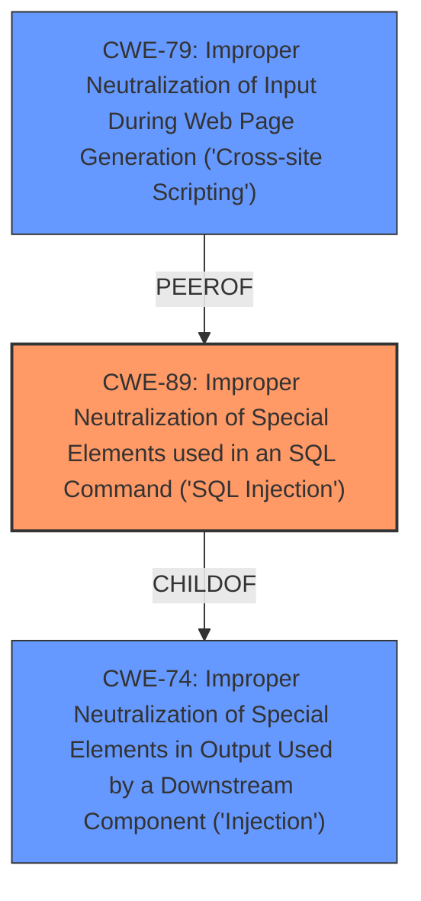

# Raw Analyzer Response for CVE-2025-1841

# Summary
| CWE ID | CWE Name | Confidence | CWE Abstraction Level | CWE Vulnerability Mapping Label | CWE-Vulnerability Mapping Notes |
|---|---|---|---|---|---|
| CWE-89 | Improper Neutralization of Special Elements used in an SQL Command ('SQL Injection') | 1.0 | Base | Allowed | Primary CWE |

## Evidence and Confidence

*   **Confidence Score:** 1.0
*   **Evidence Strength:** HIGH

## Relationship Analysis
The primary relationship that influenced the decision was the direct match of the vulnerability description to the definition of CWE-89, which is a Base level CWE. There were no other relationships that seemed more appropriate. The other CWEs were either too general (CWE-74) or addressed different types of vulnerabilities (e.g., XSS - CWE-79, File Upload - CWE-434).

## Vulnerability Chain
The vulnerability chain consists of a single step:

1.  **Root Cause:** **SQL Injection** (**CWE-89**) due to **improper neutralization** of the `startDate` and `endDate` arguments.

## Summary of Analysis
The vulnerability description clearly states that the **weakness** is **sql injection** due to the **manipulation** of the arguments `startDate/endDate`. This maps directly to **CWE-89 - Improper Neutralization of Special Elements used in an SQL Command ('SQL Injection')**. The evidence is strong, and the confidence is high.

The Retriever Results also strongly support this mapping, with CWE-89 being the top result with a score of 1.0.

Other CWEs were considered, but ultimately rejected:

*   CWE-74: Improper Neutralization of Special Elements in Output Used by a Downstream Component ('Injection') - While this is a parent of CWE-89, CWE-89 is a more specific and appropriate classification. The vulnerability is explicitly an SQL Injection, not just a general injection.
*   CWE-79: Improper Neutralization of Input During Web Page Generation ('Cross-site Scripting') - This is for Cross-Site Scripting vulnerabilities, which is not the case here.
*   CWE-434: Unrestricted Upload of File with Dangerous Type - This relates to file upload vulnerabilities, not relevant to SQL Injection.
*   CWE-117: Improper Output Neutralization for Logs - This relates to logging, not SQL injection.

The selection of CWE-89 is at the optimal level of specificity because it directly describes the type of injection vulnerability present.