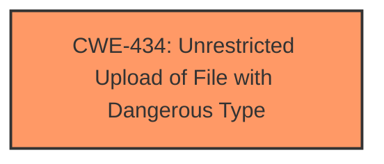

# Analysis Report for CVE-2025-1890

# Vulnerability Analysis Report: CVE-2025-1890

## Description

A vulnerability has been found in shishuocms 1.1 and classified as critical. This vulnerability affects the function handleRequest of the file src/main/java/com/shishuo/cms/action/manage/ManageUpLoadAction.java. The manipulation of the argument file leads to **unrestricted upload**. The attack can be initiated remotely. The exploit has been disclosed to the public and may be used.

## Vulnerability Description Key Phrases

- **Weakness:** unrestricted upload
- **Product:** shishuocms
- **Version:** 1.1
- **Component:** handleRequest of src/main/java/com/shishuo/cms/action/manage/ManageUpLoadAction.java

## Analysis (with Relationship Data)

# Summary
| CWE ID | CWE Name | Confidence | CWE Abstraction Level | CWE Vulnerability Mapping Label | CWE-Vulnerability Mapping Notes |
|---|---|---|---|---|---|
| CWE-434 | Unrestricted Upload of File with Dangerous Type | 1.0 | Base | Allowed | Primary CWE |

## Evidence and Confidence

*   **Confidence Score:** 1.0
*   **Evidence Strength:** HIGH

## Relationship Analysis
The primary CWE is CWE-434, which stands alone. There are relationships to other CWEs but none that are required for understanding the root cause of the vulnerability.



## Vulnerability Chain
The chain of events is straightforward: the application **allows unrestricted upload** of files, leading to the potential upload of dangerous file types.

## Summary of Analysis
The vulnerability description clearly states that there is an **unrestricted upload** issue. The key phrase "**unrestricted upload**" directly corresponds to CWE-434 (Unrestricted Upload of File with Dangerous Type). The description mentions the manipulation of the argument file leading to the vulnerability. The evidence is strong and directly supports the selection of CWE-434. All the other CWEs were considered but are not applicable because the root cause is directly related to the **unrestricted upload** of a dangerous file type.

Relevant CWE Information:

# Enhanced Context (25 CWEs)
The following CWEs were identified as potentially relevant to this vulnerability:

## CWE-434: Unrestricted Upload of File with Dangerous Type
**Abstraction Level**: Base
**Similarity Score**: 0.78
**Source**: dense

**Description**:
The product allows the upload or transfer of dangerous file types that are automatically processed within its environment.

**Mapping Guidance**:
- Usage: Allowed
- Rationale: This CWE entry is at the Base level of abstraction, which is a preferred level of abstraction for mapping to the root causes of vulnerabilities.


## CWE Relationship Analysis

Current CWEs represent these abstraction levels: .


### Vulnerability Chain Analysis

**Chain starting from CWE-434:**
- 434 (Unrestricted Upload of File with Dangerous Type) - ROOT


### CWE Relationship Diagram

```mermaid
graph TD
    classDef primary fill:#f96,stroke:#333,stroke-width:2px
    classDef secondary fill:#69f,stroke:#333
    classDef tertiary fill:#9e9,stroke:#333
```


*Report generated on 2025-07-14 08:00:56*
