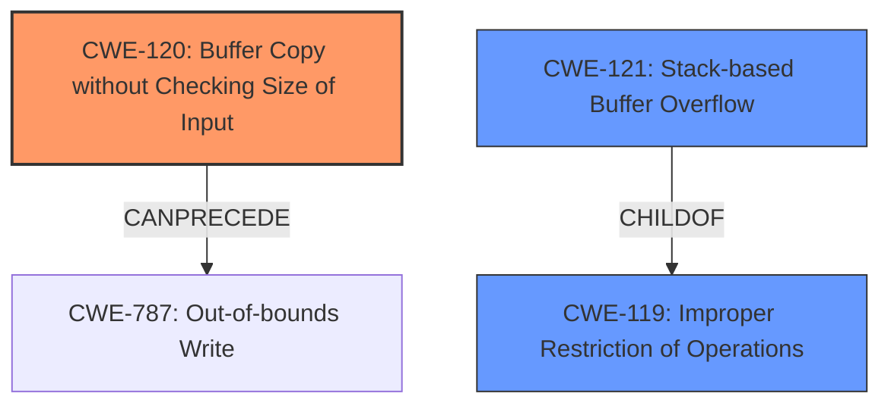

# Analysis Report for CVE-2025-1898

# Vulnerability Analysis Report: CVE-2025-1898

## Description

A vulnerability, which was classified as critical, was found in Tenda TX3 16.03.13.11_multi. Affected is an unknown function of the file /goform/openSchedWifi. The manipulation of the argument schedStartTime/schedEndTime leads to **buffer overflow**. It is possible to launch the attack remotely. The exploit has been disclosed to the public and may be used.

## Vulnerability Description Key Phrases

- **Weakness:** buffer overflow
- **Product:** Tenda TX3
- **Version:** 16.03.13.11_multi
- **Component:** /goform/openSchedWifi

## Analysis (with Relationship Data)

# Summary

| CWE ID  | CWE Name                                                                    | Confidence | CWE Abstraction Level | CWE Vulnerability Mapping Label | CWE-Vulnerability Mapping Notes |
| :-------- | :-------------------------------------------------------------------------- | :--------- | :-------------------- | :------------------------------ | :------------------------------ |
| CWE-120   | Buffer Copy without Checking Size of Input ('Classic Buffer Overflow') | 0.75       | Base                  | Primary                         | Allowed-with-Review             |
| CWE-121   | Stack-based Buffer Overflow                                                 | 0.60       | Variant               | Secondary                       | Allowed                       |
| CWE-119   | Improper Restriction of Operations within the Bounds of a Memory Buffer    | 0.50       | Class                  | Secondary                       | Discouraged                    |

## Evidence and Confidence

*   **Confidence Score:** 0.70
*   **Evidence Strength:** MEDIUM

## Relationship Analysis

The primary weakness is a buffer overflow. CWE-120 is a base-level CWE that describes a buffer copy without checking the size of the input. CWE-121, a variant, specifies a stack-based buffer overflow. CWE-119 is a more general class. The relationships show that CWE-121 is a child of CWE-119, and CWE-120 can precede CWE-787 (Out-of-bounds Write). The abstraction levels influenced the selection by favoring the more specific Base and Variant levels over the broader Class level.



## Vulnerability Chain

The vulnerability chain starts with a **buffer overflow** due to the program not checking the size of the input when copying data to a buffer. This leads to an out-of-bounds write, potentially overwriting data on the stack, causing the program to crash or allow for arbitrary code execution.

## Summary of Analysis

The vulnerability description indicates a **buffer overflow** when manipulating the `schedStartTime/schedEndTime` arguments in the `/goform/openSchedWifi` component of Tenda TX3 firmware. The retriever results suggest CWE-119 (Improper Restriction of Operations within the Bounds of a Memory Buffer), CWE-190 (Integer Overflow or Wraparound), and CWE-120 (Buffer Copy without Checking Size of Input ('Classic Buffer Overflow')) as potential candidates.

Given the description explicitly mentions **buffer overflow** due to manipulation of arguments leading to the **buffer overflow**, CWE-120 (Buffer Copy without Checking Size of Input ('Classic Buffer Overflow')) is chosen as the primary CWE. The description doesn't give enough information to determine if it is a stack or heap overflow, but CWE-121 (Stack-based Buffer Overflow) is included as a secondary candidate because it is a common type of buffer overflow. CWE-119 is included as a secondary candidate because it is a more general description of memory buffer errors.

The selection is based on the evidence that a buffer is being overflowed due to missing size validation when copying the arguments.

Relevant CWE Information:

# Enhanced Context (25 CWEs)
The following CWEs were identified as potentially relevant to this vulnerability:

## CWE-121: Stack-based Buffer Overflow
**Abstraction Level**: Variant
**Similarity Score**: 0.74
**Source**: dense

**Description**:
A stack-based buffer overflow condition is a condition where the buffer being overwritten is allocated on the stack (i.e., is a local variable or, rarely, a parameter to a function).

**Mapping Guidance**:
- Usage: Allowed
- Rationale: This CWE entry is at the Variant level of abstraction, which is a preferred level of abstraction for mapping to the root causes of vulnerabilities.

## CWE-120: Buffer Copy without Checking Size of Input ('Classic Buffer Overflow')
**Abstraction Level**: base
**Similarity Score**: 3.65
**Source**: graph

**Description**:
CWE-120: Buffer Copy without Checking Size of Input ('Classic Buffer Overflow')

**Mapping Guidance**:
- Usage: Allowed-with-Review
- Rationale: There are some indications that this CWE ID might be misused and selected simply because it mentions "buffer overflow" - an increasingly vague term. This CWE entry is only appropriate for "Buffer Copy" operations (not buffer reads), in which where there is no "Checking [the] Size of Input", and (by implication of the copy) writing past the end of the buffer.

**Relationships**:
- PARENTOF -> CWE-785
- CANFOLLOW -> CWE-456
- CANFOLLOW -> CWE-416
- CANFOLLOW -> CWE-231
- CANFOLLOW -> CWE-170


## CWE Relationship Analysis

Current CWEs represent these abstraction levels: .


### Vulnerability Chain Analysis

**Chain starting from CWE-121:**
- 121 (Stack-based Buffer Overflow) - ROOT


**Chain starting from CWE-416:**
- 416 (Use After Free) - ROOT


### CWE Relationship Diagram

```mermaid
graph TD
    classDef primary fill:#f96,stroke:#333,stroke-width:2px
    classDef secondary fill:#69f,stroke:#333
    classDef tertiary fill:#9e9,stroke:#333
```


*Report generated on 2025-07-14 08:02:34*
