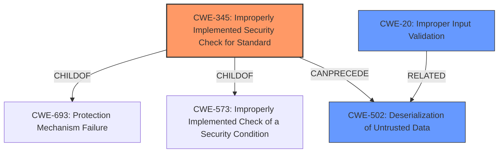

# Enhanced Analysis for CVE-2025-1945

# Summary
| CWE ID | CWE Name | Confidence | CWE Abstraction Level | CWE Vulnerability Mapping Label | CWE-Vulnerability Mapping Notes |
|---|---|---|---|---|---|
| CWE-345 | Improperly Implemented Security Check for Standard | 0.9 | Base | Allowed | Primary CWE. The core issue is that PickleScan's security check for ZIP files is not robust enough.|
| CWE-502 | Deserialization of Untrusted Data | 0.7 | Base | Allowed | Secondary CWE. The vulnerability allows for the deserialization of untrusted data, leading to arbitrary code execution. |
| CWE-20 | Improper Input Validation | 0.6 | Class | Allowed | Secondary CWE. The pickle file represents the external input, and the product does not validate or incorrectly validates that the input. |

## Evidence and Confidence

*   **Confidence Score:** 0.8
*   **Evidence Strength:** HIGH

## Relationship Analysis
The primary weakness is CWE-345, because the product **does not properly implement a security check**. This leads to CWE-502 because the **improper security check** allows for **deserialization of untrusted data**. CWE-345 is a child of CWE-693 and CWE-573, indicating it's related to security standards and improper implementation.



## Vulnerability Chain
The vulnerability chain starts with PickleScan's **improper implementation of a security check (CWE-345)**. This leads to the ability to **deserialize untrusted data (CWE-502)**, resulting in arbitrary code execution.

## Summary of Analysis
The primary CWE is CWE-345, as the **root cause** is the **improperly implemented security check** in PickleScan. The vulnerability description and CVE reference links explicitly mention that PickleScan fails to properly handle modified ZIP file flag bits, allowing malicious pickle files to bypass detection. This aligns directly with CWE-345's description of an **improperly implemented security check for a standard**. The evidence is strong, as multiple sources confirm this root cause. This leads to CWE-502 since the **improper check** allows the **deserialization of untrusted data**.

Other CWEs considered but not used:
*   CWE-59: Improper Link Resolution Before File Access ('Link Following') - While the vulnerability involves file access, it's not directly related to link resolution.
*   CWE-23: Relative Path Traversal - This CWE is not applicable as the vulnerability does not involve path traversal.
*   CWE-22: Improper Limitation of a Pathname to a Restricted Directory ('Path Traversal') - Similar to CWE-23, this is not relevant.
*   CWE-95: Improper Neutralization of Directives in Dynamically Evaluated Code ('Eval Injection') - This is related to code injection, but the core issue is the deserialization of untrusted data, not the injection of code.
*   CWE-73: External Control of File Name or Path - While the filename is a factor, the core issue is the **improper security check**, not the external control of the filename.


## CWE Relationship Analysis

Current CWEs represent these abstraction levels: .


### Vulnerability Chain Analysis

**Chain starting from CWE-502:**
- 502 (Deserialization of Untrusted Data) - ROOT


**Chain starting from CWE-345:**
- 345 (Insufficient Verification of Data Authenticity) - ROOT


### CWE Relationship Diagram

```mermaid
graph TD
    classDef primary fill:#f96,stroke:#333,stroke-width:2px
    classDef secondary fill:#69f,stroke:#333
    classDef tertiary fill:#9e9,stroke:#333
```