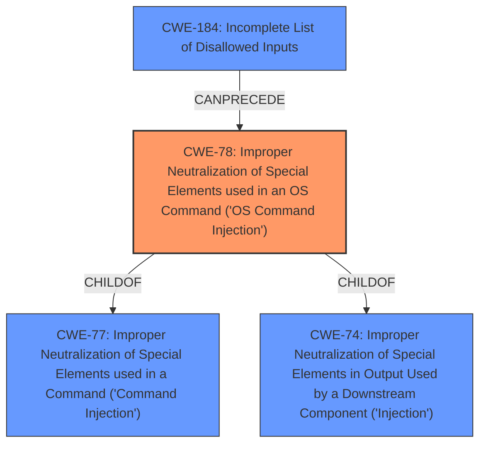

# Analysis Report for CVE-2025-1947

# Vulnerability Analysis Report: CVE-2025-1947

## Description

A vulnerability classified as critical has been found in hzmanyun Education and Training System 2.1.3. This affects the function scorm of the file UploadImageController.java. The manipulation of the argument param leads to **command injection**. It is possible to initiate the attack remotely. The exploit has been disclosed to the public and may be used.

## Vulnerability Description Key Phrases

- **Weakness:** command injection
- **Product:** hzmanyun Education and Training System
- **Version:** 2.1.3
- **Component:** scorm UploadImageController.java

## Analysis (with Relationship Data)

# Summary
| CWE ID | CWE Name | Confidence | CWE Abstraction Level | CWE Vulnerability Mapping Label | CWE-Vulnerability Mapping Notes |
|---|---|---|---|---|---|
| CWE-78 | Improper Neutralization of Special Elements used in an OS Command ('OS Command Injection') | 1.0 | Base | Allowed | Primary CWE |

## Evidence and Confidence

*   **Confidence Score:** 1.0
*   **Evidence Strength:** HIGH

## Relationship Analysis
The primary CWE is CWE-78, which is a base level CWE. It is a child of CWE-77 (Class) and CWE-74 (Class). CWE-78 can be preceded by CWE-184 (Base).



## Vulnerability Chain
The vulnerability chain starts with the **improper neutralization** of input, leading to **OS command injection**.

## Summary of Analysis
The vulnerability description explicitly states that the manipulation of the argument `param` leads to **command injection**. The best fit for this is CWE-78, "Improper Neutralization of Special Elements used in an OS Command ('OS Command Injection')", as it is a specific type of **command injection** related to operating system commands. The retriever results also list CWE-78 as a high contender.

Other CWEs considered:

*   CWE-77: Improper Neutralization of Special Elements used in a Command ('Command Injection') - While this is a parent of CWE-78, CWE-78 is more specific and thus a better fit.
*   CWE-89: Improper Neutralization of Special Elements used in an SQL Command ('SQL Injection') - This is specific to SQL commands, which is not indicated in the vulnerability description.
*   CWE-79: Improper Neutralization of Input During Web Page Generation ('Cross-site Scripting') - This is related to web page generation and XSS, not command injection.
*   CWE-1336: Improper Neutralization of Special Elements Used in a Template Engine - This is specific to template engines, which is not indicated in the vulnerability description.
*   CWE-434: Unrestricted Upload of File with Dangerous Type - This relates to file uploads, not command injection via parameter manipulation.

Relevant CWE Information:
*   Vulnerability Description Key Phrases:
    *   **weakness:** **command injection**
    *   **product:** hzmanyun Education and Training System
    *   **version:** 2.1.3
    *   **component:** scorm UploadImageController.java


## CWE Relationship Analysis

Current CWEs represent these abstraction levels: .


### Vulnerability Chain Analysis

**Chain starting from CWE-89:**
- 89 (Improper Neutralization of Special Elements used in an SQL Command ('SQL Injection')) - ROOT


**Chain starting from CWE-77:**
- 77 (Improper Neutralization of Special Elements used in a Command ('Command Injection')) - ROOT


### CWE Relationship Diagram

```mermaid
graph TD
    classDef primary fill:#f96,stroke:#333,stroke-width:2px
    classDef secondary fill:#69f,stroke:#333
    classDef tertiary fill:#9e9,stroke:#333
```


*Report generated on 2025-07-14 08:07:03*
