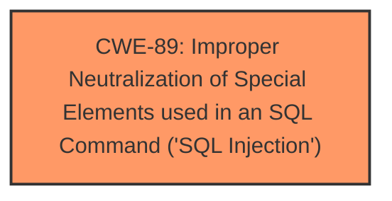

# Enhanced Analysis for CVE-2025-1962

# Summary

| CWE ID  | CWE Name                                                                        | Confidence | CWE Abstraction Level | CWE Vulnerability Mapping Label | CWE-Vulnerability Mapping Notes |
| :-------- | :------------------------------------------------------------------------------ | :--------- | :-------------------- | :------------------------------ | :------------------------------ |
| CWE-89  | Improper Neutralization of Special Elements used in an SQL Command ('SQL Injection') | 1          | Base                  | Primary CWE                     | Allowed                       |

## Evidence and Confidence

*   **Confidence Score:** 1
*   **Evidence Strength:** HIGH

## Relationship Analysis

The primary relationship identified is that CWE-89 stands as a base-level weakness, directly addressing the root cause of the vulnerability. No other parent-child, chain, or peer relationships were deemed relevant in this specific case, as the description clearly points to SQL injection. The abstraction level of 'Base' for CWE-89 aligns with the goal of pinpointing the fundamental flaw in the system.



## Vulnerability Chain

The vulnerability chain consists of:
1.  **Root Cause:** **Improper neutralization of special elements** in the `roomname` argument leading to SQL injection (CWE-89).
2.  **Impact:** Unauthorized database access, sensitive data leakage, data tampering, system control, and service interruption.

The chain starts with the **lack of proper input validation** on the `roomname` parameter, allowing malicious SQL code to be injected. This injection then leads to several potential impacts on the system.

## Summary of Analysis

The initial analysis strongly suggests CWE-89, based on the vulnerability description and the CVE Reference Links Content Summary, which explicitly mentions SQL injection due to insufficient input validation of the `roomname` parameter.

The key evidence supporting this decision includes:

*   Vulnerability Description Key Phrases: "**weakness:** **sql injection**", "**vector:** manipulation of roomname argument"
*   CVE Reference Links Content Summary: "The root cause is insufficient user input validation of the 'roomname' parameter in the `/admin/addroom.php` file. Attackers can inject malicious code directly into SQL queries without proper cleaning or validation."

Given that the vulnerability is explicitly identified as SQL injection due to **improper neutralization** within the `roomname` parameter, CWE-89 is the most accurate and specific classification. The retriever results also list CWE-89 with a high similarity score.

The other CWEs were considered, but ultimately rejected:

*   CWE-79 (Improper Neutralization of Input During Web Page Generation ('Cross-site Scripting')): While input neutralization is a general concern, the specific context points to SQL injection rather than XSS.
*   CWE-434 (Unrestricted Upload of File with Dangerous Type): This CWE is not relevant as the vulnerability does not involve file uploads.
*   CWE-1336 (Improper Neutralization of Special Elements Used in a Template Engine): This is not relevant as the vulnerability does not involve Template Engine.

Therefore, the final assessment focuses solely on CWE-89 as the primary and most relevant CWE. The selection of CWE-89 is at the optimal level of specificity because it directly addresses the **root cause** of the vulnerability, which is the **improper handling of SQL special elements** in the `roomname` parameter.


## CWE Relationship Analysis

Current CWEs represent these abstraction levels: .


### Vulnerability Chain Analysis

**Chain starting from CWE-89:**
- 89 (Improper Neutralization of Special Elements used in an SQL Command ('SQL Injection')) - ROOT


**Chain starting from CWE-79:**
- 79 (Improper Neutralization of Input During Web Page Generation ('Cross-site Scripting')) - ROOT


### CWE Relationship Diagram

```mermaid
graph TD
    classDef primary fill:#f96,stroke:#333,stroke-width:2px
    classDef secondary fill:#69f,stroke:#333
    classDef tertiary fill:#9e9,stroke:#333
```