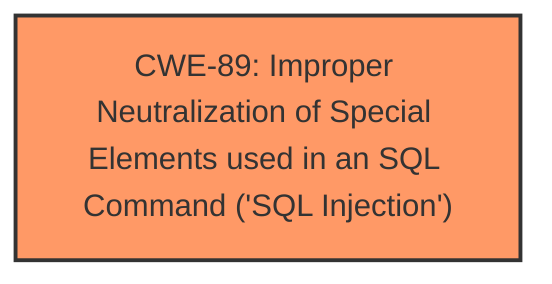

# Raw Analyzer Response for CVE-2025-1963

# Summary
| CWE ID | CWE Name | Confidence | CWE Abstraction Level | CWE Vulnerability Mapping Label | CWE-Vulnerability Mapping Notes |
|---|---|---|---|---|---|
| CWE-89 | Improper Neutralization of Special Elements used in an SQL Command ('SQL Injection') | 1.0 | Base | Allowed | Primary CWE. The vulnerability description clearly states that the **weakness** is **SQL injection** due to manipulation of the checkin argument. |

## Evidence and Confidence

*   **Confidence Score:** 1.0
*   **Evidence Strength:** HIGH

## Relationship Analysis
The primary CWE is CWE-89, which stands alone. The Retriever Results do not suggest any parent, child, or chain relationships.

## Vulnerability Chain
The vulnerability chain consists of:
1.  **Root Cause:** CWE-89 - Improper Neutralization of Special Elements used in an SQL Command ('SQL Injection') due to insufficient input validation of the 'checkin' parameter.
2.  **Impact:** Unauthorized database access, sensitive data leakage, data tampering, comprehensive system control, and even service interruption.

## Summary of Analysis
The initial analysis correctly identified CWE-89 as the primary **weakness** due to the **SQL injection** vulnerability. The vulnerability description and CVE reference links content summary directly support this classification. The analysis is based on the provided evidence, specifically: "manipulation of the argument checkin leads to **sql injection**" and "insufficient user input validation of the 'checkin' parameter allows attackers to inject malicious SQL queries."

The graph relationships did not influence the final selection, as CWE-89 stands alone based on the provided information.

The selected CWE is at the optimal level of specificity (Base) as it directly represents the root cause of the vulnerability.

The other CWEs were considered from the retriever results but are not a good fit:
*   CWE-79: Improper Neutralization of Input During Web Page Generation ('Cross-site Scripting') - This is not the right fit since the vulnerability is related to SQL injection, not XSS.
*   CWE-117: Improper Output Neutralization for Logs - This is not the right fit since the vulnerability is related to SQL injection, not logging.
*   CWE-434: Unrestricted Upload of File with Dangerous Type - This is not the right fit since the vulnerability is related to SQL injection, not file uploads.
*   CWE-99: Improper Control of Resource Identifiers ('Resource Injection') - This is not the right fit since the vulnerability is related to SQL injection, not resource injection.
*   CWE-1336: Improper Neutralization of Special Elements Used in a Template Engine - This is not the right fit since the vulnerability is related to SQL injection, not template engine.
*   CWE-116: Improper Encoding or Escaping of Output - This is not the right fit since the vulnerability is related to SQL injection, not output encoding.
*   CWE-1391: Use of Weak Credentials - This is not the right fit since the vulnerability is related to SQL injection, not weak credentials.
*   CWE-472: External Control of Assumed-Immutable Web Parameter - This is not the right fit since the vulnerability is related to SQL injection, not immutable web parameters.
*   CWE-73: External Control of File Name or Path - This is not the right fit since the vulnerability is related to SQL injection, not file name or path.