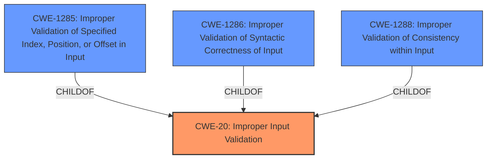

# Analysis Report for CVE-2025-20031

# Vulnerability Analysis Report: CVE-2025-20031

## Description

**Improper input validation** for some Intel(R) Graphics Drivers may allow an authenticated user to potentially enable denial of service via local access.

## Vulnerability Description Key Phrases

- **Rootcause:** Improper input validation
- **Impact:** denial of service
- **Vector:** local access
- **Attacker:** authenticated user
- **Product:** Intel(R) Graphics Drivers

## Analysis (with Relationship Data)

# Summary
| CWE ID | CWE Name | Confidence | CWE Abstraction Level | CWE Vulnerability Mapping Label | CWE-Vulnerability Mapping Notes |
|---|---|---|---|---|---|
| CWE-20 | Improper Input Validation | 0.9 | Class | Primary CWE | Discouraged, but appropriate given the lack of specific details. |

## Evidence and Confidence

*   **Confidence Score:** 0.9
*   **Evidence Strength:** MEDIUM

## Relationship Analysis
The primary relationship that influenced my decision was the parent-child relationship between CWE-20 and more specific input validation CWEs. While ideally a more specific CWE would be chosen, the limited information available makes CWE-20 the most appropriate choice.



## Vulnerability Chain
The vulnerability chain starts with **improper input validation** (CWE-20), which leads to a potential denial of service.

## Summary of Analysis
The analysis centers on identifying the root cause of the vulnerability based on the provided information. The vulnerability description explicitly states that the root cause is **improper input validation**.

The primary evidence for this assessment is the phrase "**Improper input validation**" in both the "Vulnerability Description Key Phrases" and the "CVE Reference Links Content Summary" sections.

Given the limited details, CWE-20 is the most appropriate, despite the guidance discouraging its use when more specific information is available. I considered the retriever results and the complete CWE specifications. Several more specific CWEs related to input validation were considered, such as CWE-1285, CWE-1286, and CWE-1288. However, without more information, it's impossible to determine if the **improper input validation** relates to index/offset validation, syntactic correctness, or consistency. Therefore, the more general CWE-20 is the most accurate choice.


## CWE Relationship Analysis

Current CWEs represent these abstraction levels: .


### Vulnerability Chain Analysis

**Chain starting from CWE-1288:**
- 1288 (Improper Validation of Consistency within Input) - ROOT


**Chain starting from CWE-1286:**
- 1286 (Improper Validation of Syntactic Correctness of Input) - ROOT


### CWE Relationship Diagram

```mermaid
graph TD
    classDef primary fill:#f96,stroke:#333,stroke-width:2px
    classDef secondary fill:#69f,stroke:#333
    classDef tertiary fill:#9e9,stroke:#333
```


*Report generated on 2025-07-14 08:13:25*
