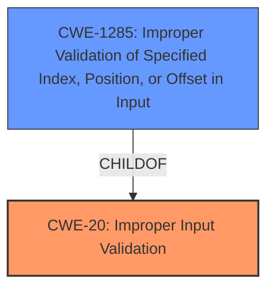

# Raw Analyzer Response for CVE-2025-20034

# Summary
| CWE ID  | CWE Name                                                                    | Confidence | CWE Abstraction Level | CWE Vulnerability Mapping Label | CWE-Vulnerability Mapping Notes |
| :-------- | :-------------------------------------------------------------------------- | :---------- | :---------------------- | :------------------------------ | :-------------------------------- |
| CWE-20    | CWE-20: Improper Input Validation                                           | 0.85       | Class                   | Primary                         | Discouraged                      |
| CWE-1285  | CWE-1285: Improper Validation of Specified Index, Position, or Offset in Input | 0.75       | Base                    | Secondary                       | Allowed                          |

## Evidence and Confidence

*   **Confidence Score:** 0.80
*   **Evidence Strength:** MEDIUM

## Relationship Analysis
The primary relationship is that CWE-1285 is a more specific type of CWE-20. CWE-20 is a class-level CWE, while CWE-1285 is a base-level CWE which is more specific.

## Vulnerability Chain
The vulnerability chain starts with the **improper input validation** (**root cause**) in the BackupBiosUpdate UEFI firmware SmiVariable driver, which leads to the impact of information disclosure.

## Summary of Analysis
The vulnerability description indicates that the root cause is **improper input validation** in the BackupBiosUpdate UEFI firmware SmiVariable driver. This **improper input validation** can lead to information disclosure.

The primary CWE is CWE-20: Improper Input Validation. Although CWE-20 is discouraged, it is the best fit based on the provided evidence. The vulnerability description clearly states **improper input validation** as the root cause. However, there is a more specific CWE available, CWE-1285, which is "Improper Validation of Specified Index, Position, or Offset in Input". Since the vulnerability occurs within the SmiVariable driver which likely handles indices, positions, or offsets, CWE-1285 is considered as a secondary candidate.

Relevant CWE Information:

# Enhanced Context (25 CWEs)
The following CWEs were identified as potentially relevant to this vulnerability:

## CWE-1285: Improper Validation of Specified Index, Position, or Offset in Input
**Abstraction Level**: Base
**Similarity Score**: 0.76
**Source**: dense

**Description**:
The product receives input that is expected to specify an index, position, or offset into an indexable resource such as a buffer or file, but it does not validate or incorrectly validates that the specified index/position/offset has the required properties.

**Mapping Guidance**:
- Usage: Allowed
- Rationale: This CWE entry is at the Base level of abstraction, which is a preferred level of abstraction for mapping to the root causes of vulnerabilities.

## CWE-20: Improper Input Validation
**Abstraction Level**: Class
**Similarity Score**: 0.74
**Source**: dense

**Description**:
The product receives input or data, but it does
        not validate or incorrectly validates that the input has the
        properties that are required to process the data safely and
        correctly.

**Mapping Guidance**:
- Usage: Discouraged
- Rationale: CWE-20 is commonly misused in low-information vulnerability reports when lower-level CWEs could be used instead, or when more details about the vulnerability are available [REF-1287]. It is not useful for trend analysis. It is also a level-1 Class (i.e., a child of a Pillar).

The retriever results also list CWE-1285 as a candidate. Given that the vulnerability occurs in the SmiVariable driver, it is plausible that the **improper validation** relates to an index, position, or offset. Therefore, CWE-1285 is a strong candidate to consider as a secondary CWE.

CWE-119 is also listed, but the description doesn't directly point to memory buffer issues, making it a less suitable choice.

CWE-190 is related to integer overflows, which isn't explicitly mentioned in the description.

CWE-22 is "Improper Limitation of a Pathname to a Restricted Directory ('Path Traversal')", but the description does not suggest anything related to path traversal.

CWE-73 is "External Control of File Name or Path", which is also not suggested by the vulnerability description.

In summary, CWE-20 and CWE-1285 are the most appropriate based on the information provided, even though CWE-20 is discouraged.