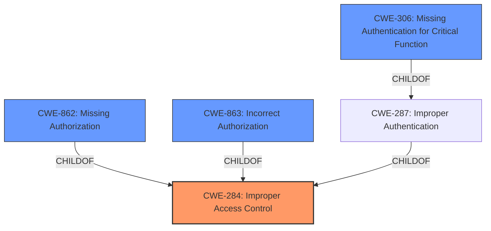

# Analysis for CVE-2025-20052

# Summary
| CWE ID | CWE Name | Confidence | CWE Abstraction Level | CWE Vulnerability Mapping Label | CWE-Vulnerability Mapping Notes |
|---|---|---|---|---|---|
| CWE-284 | Improper Access Control | 0.8 | Pillar | Primary CWE | Discouraged |

## Evidence and Confidence

*   **Confidence Score:** 0.8
*   **Evidence Strength:** HIGH

## Relationship Analysis
The primary identified CWE is CWE-284 (Improper Access Control), which is a high-level category. The retriever results suggested more specific CWEs related to authentication and authorization, such as CWE-306 (Missing Authentication for Critical Function), CWE-862 (Missing Authorization), and CWE-863 (Incorrect Authorization). However, based on the provided information, it is unclear whether the **improper access control** is due to missing authentication, missing authorization, or an incorrect authorization check. Therefore, CWE-284 is the most appropriate choice, even though it's a high-level class.

## Vulnerability Chain
The vulnerability chain starts with **improper access control**, which leads to a denial of service.

Improper Access Control -> Denial of Service

## Summary of Analysis
The initial analysis identified **improper access control** as the root cause of the vulnerability, leading to a denial of service. The Retriever Results provided several candidate CWEs, and the "Authentication vs Authorization vs Access Control Guidance" helped refine the selection. Given the limited information about the specific nature of the **improper access control**, CWE-284 (Improper Access Control) was selected as the most appropriate CWE. This choice is based on the vulnerability description and the CVE reference links content summary, which both highlight **improper access control** as the primary weakness.

The evidence for the selection is directly from the Vulnerability Description Key Phrases and CVE Reference Links Content Summary:

*   "**rootcause:** **Improper access control**"
*   "**Weaknesses/vulnerabilities present:** **Improper access control**."

The graph relationships influenced the decision by highlighting potential child CWEs like CWE-306, CWE-862, and CWE-863, but the lack of specific information prevented a more precise mapping. CWE-284 is at the appropriate level of specificity given the available evidence.

Relevant CWE Information:
*   CWE-284: Improper Access Control - This is a high-level category used when the access control failure exists, but the root cause is unclear.