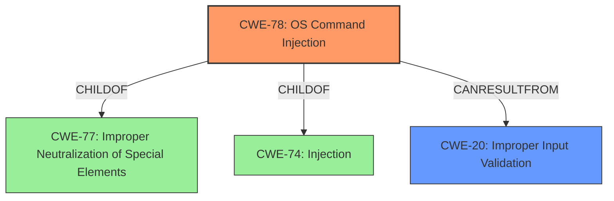

# Analysis for CVE-2025-20117

# Summary
| CWE ID | CWE Name | Confidence | CWE Abstraction Level | CWE Vulnerability Mapping Label | CWE-Vulnerability Mapping Notes |
|---|---|---|---|---|---|
| CWE-78 | Improper Neutralization of Special Elements used in an OS Command ('OS Command Injection') | 0.9 | Base | Primary CWE | Allowed |
| CWE-20 | Improper Input Validation | 0.6 | Class | Secondary Candidate | Discouraged |

## Evidence and Confidence

*   **Confidence Score:** 0.8
*   **Evidence Strength:** HIGH

## Relationship Analysis
The primary relationship that influences this assessment is that CWE-78 is a specific type of injection vulnerability that stems from **improper input validation**. CWE-78 is a child of CWE-77 (Improper Neutralization of Special Elements used in a Command) and CWE-74 (Improper Neutralization of Special Elements in Output Used by a Downstream Component ('Injection')). The relationship between CWE-20 (Improper Input Validation) and CWE-78 is that **improper input validation** often leads to command injection vulnerabilities. The abstraction levels were considered, and CWE-78, being a Base level CWE, was preferred over the Class level CWE-20 because it provided a more specific description of the vulnerability.

## Vulnerability Chain
The vulnerability chain starts with **insufficient validation of arguments** passed to CLI commands (CWE-20), which allows an attacker to inject special elements into an OS command (CWE-78), leading to the execution of arbitrary commands as root on the system.

## Summary of Analysis
The initial analysis identified CWE-78 as the primary weakness due to the vulnerability description explicitly stating that the vulnerability is due to **insufficient validation of arguments** passed to CLI commands, leading to arbitrary command execution. The retriever results also ranked CWE-78 as the top candidate. CWE-20 was considered as a possible root cause, and is added as a secondary candidate because **improper input validation** is a common prerequisite for command injection vulnerabilities. However, CWE-78 more directly describes the vulnerability. This assessment is primarily based on the provided evidence, specifically the vulnerability description and the CVE reference summary which highlights the **insufficient validation** and command injection. The graph relationships influenced the decision by showing the connection between **improper input validation** and command injection. The selected CWEs are at the optimal level of specificity, with CWE-78 being a base-level CWE that accurately describes the vulnerability and CWE-20 as a Class level CWE that indicates a more general weakness.

Relevant CWE Information:

*   **CWE-78:** The product constructs all or part of an operating system command using externally-influenced input from an upstream component, but it does not neutralize or incorrectly neutralizes special elements that could modify the intended OS command when it is executed.
*   **CWE-20:** The product receives input or data, but it does not validate or incorrectly validates that the input has the properties that are required to process the data safely and correctly.

The following CWEs were considered but not used:

*   **CWE-269 Improper Privilege Management:** This was not chosen because the vulnerability isn't directly related to privilege management but rather to command injection due to **improper input validation**.
*   **CWE-88 Improper Neutralization of Argument Delimiters in a Command ('Argument Injection'):** While related, CWE-78 is a more general case of command injection, and the description doesn't specifically mention argument delimiters being the issue.
*   **CWE-250 Execution with Unnecessary Privileges:** This was not chosen as the root cause because the core issue is the **lack of input validation**, not the privileges under which the command is executed.
*   **CWE-22 Improper Limitation of a Pathname to a Restricted Directory ('Path Traversal'):** This CWE is not relevant because the vulnerability isn't related to path traversal.
*   **CWE-807 Reliance on Untrusted Inputs in a Security Decision:** This is too general. The problem is not just reliance on untrusted input, but the **lack of proper neutralization** that leads to command injection.