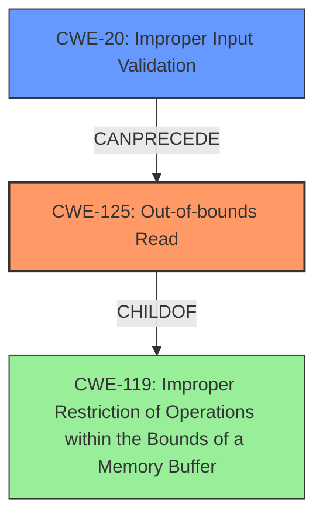

# Analysis Report for CVE-2025-2012

# Vulnerability Analysis Report: CVE-2025-2012

## Description

Ashlar-Vellum Cobalt VS File Parsing Out-Of-Bounds Read Remote Code Execution Vulnerability. This vulnerability allows remote attackers to execute arbitrary code on affected installations of Ashlar-Vellum Cobalt. User interaction is required to exploit this vulnerability in that the target must visit a malicious page or open a malicious file. The specific flaw exists within the parsing of VS files. The issue results from the **lack of proper validation of user-supplied data**, which can result in a read past the end of an allocated buffer. An attacker can leverage this vulnerability to execute code in the context of the current process. Was ZDI-CAN-25185.

## Vulnerability Description Key Phrases

- **Rootcause:** lack of proper validation of user-supplied data
- **Vector:** malicious page or open a malicious file
- **Weakness:** Out-Of-Bounds Read, read past the end of an allocated buffer
- **Product:** Ashlar-Vellum Cobalt
- **Impact:** execute arbitrary code, execute code in the context of the current process, Remote Code Execution
- **Attacker:** remote attackers

## Analysis (with Relationship Data)

# Summary
| CWE ID | CWE Name | Confidence | CWE Abstraction Level | CWE Vulnerability Mapping Label | CWE-Vulnerability Mapping Notes |
|---|---|---|---|---|---|
| CWE-125 | Out-of-bounds Read | 1.0 | Base | Allowed | Primary CWE. The **lack of proper validation of user-supplied data** leads to a read past the end of an allocated buffer. |
| CWE-20 | Improper Input Validation | 0.75 | Class | Discouraged | Secondary CWE. The **lack of proper validation of user-supplied data** is a contributing factor, but it's a general weakness, and CWE-125 is more specific. |

## Evidence and Confidence

*   **Confidence Score:** 0.9
*   **Evidence Strength:** HIGH

## Relationship Analysis
The primary weakness is **CWE-125 (Out-of-bounds Read)**, which stems from **CWE-20 (Improper Input Validation)**. **CWE-125** is a child of **CWE-119 (Improper Restriction of Operations within the Bounds of a Memory Buffer)**, illustrating a hierarchical relationship. The vulnerability chain begins with the lack of input validation (**CWE-20**), leading to the out-of-bounds read (**CWE-125**).



## Vulnerability Chain
The vulnerability chain starts with **CWE-20 (Improper Input Validation)**, where user-supplied data is not properly validated. This leads to **CWE-125 (Out-of-bounds Read)**, where the program reads data past the end of an allocated buffer. The impact is the ability to execute arbitrary code on affected installations.

## Summary of Analysis
The analysis is primarily based on the vulnerability description, which explicitly states "**lack of proper validation of user-supplied data**, which can result in a read past the end of an allocated buffer." The **root cause** is the **lack of proper validation**, but the **weakness** is the **Out-Of-Bounds Read**. The retriever results also support this analysis, with **CWE-125** being a top candidate. **CWE-20** is considered as a contributing factor but is less specific than **CWE-125**.

I considered CWE-787 (Out-of-bounds Write), CWE-122 (Heap-based Buffer Overflow), and CWE-190 (Integer Overflow or Wraparound), but these were not selected because the description specifically mentions a read operation rather than a write or overflow. While a buffer overflow can lead to an out-of-bounds read, the description does not provide enough evidence to support this.

The selected CWEs are at the optimal level of specificity because they accurately represent the weakness described in the vulnerability description.
Relevant CWE Information:

# Enhanced Context (25 CWEs)
The following CWEs were identified as potentially relevant to this vulnerability:

## CWE-125: Out-of-bounds Read
**Abstraction Level**: Base
**Similarity Score**: 0.71
**Source**: dense

**Description**:
The product reads data past the end, or before the beginning, of the intended buffer.

**Mapping Guidance**:
- Usage: Allowed
- Rationale: This CWE entry is at the Base level of abstraction, which is a preferred level of abstraction for mapping to the root causes of vulnerabilities.
## CWE-20: Improper Input Validation
**Abstraction Level**: Class
**Similarity Score**: 0.71
**Source**: dense

**Description**:
The product receives input or data, but it does not validate or incorrectly validates that the input has the properties that are required to process the data safely and correctly.

**Mapping Guidance**:
- Usage: Discouraged
- Rationale: This CWE entry is a Class and might have Base-level children that would be more appropriate


## CWE Relationship Analysis

Current CWEs represent these abstraction levels: .


### Vulnerability Chain Analysis

**Chain starting from CWE-125:**
- 125 (Out-of-bounds Read) - ROOT


**Chain starting from CWE-787:**
- 787 (Out-of-bounds Write) - ROOT


### CWE Relationship Diagram

```mermaid
graph TD
    classDef primary fill:#f96,stroke:#333,stroke-width:2px
    classDef secondary fill:#69f,stroke:#333
    classDef tertiary fill:#9e9,stroke:#333
```


*Report generated on 2025-07-14 08:17:48*
