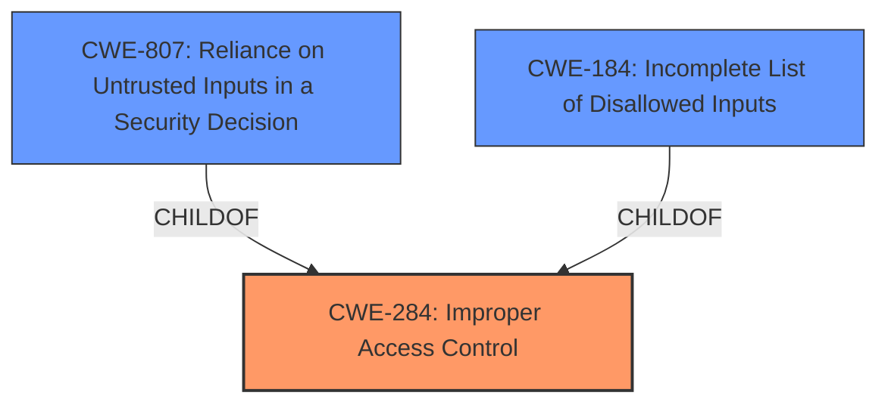

# Analysis Report for CVE-2025-20153

# Vulnerability Analysis Report: CVE-2025-20153

## Description

A vulnerability in the email filtering mechanism of Cisco Secure Email Gateway could allow an unauthenticated, remote attacker to bypass the configured rules and allow emails that should have been denied to flow through an affected device. &nbsp This vulnerability is due to **improper handling of email** that passes through an affected device. An attacker could exploit this vulnerability by sending a crafted email through the affected device. A successful exploit could allow the attacker to bypass email filters on the affected device.

## Vulnerability Description Key Phrases

- **Rootcause:** improper handling of email
- **Impact:** bypass email filters
- **Vector:** crafted email
- **Attacker:** unauthenticated remote attacker
- **Product:** Cisco Secure Email Gateway
- **Component:** email filtering mechanism

## Analysis (with Relationship Data)

# Summary

| CWE ID  | CWE Name                                                                             | Confidence | CWE Abstraction Level | CWE Vulnerability Mapping Label | CWE-Vulnerability Mapping Notes |
| :-------- | :----------------------------------------------------------------------------------- | :--------- | :---------------------- | :------------------------------ | :------------------------------ |
| CWE-284   | Improper Access Control                                                              | 0.75       | Class                     | Primary CWE                     | Discouraged                     |
| CWE-807   | Reliance on Untrusted Inputs in a Security Decision                                | 0.60       | Base                      | Secondary Candidate             | Allowed                         |
| CWE-184   | Incomplete List of Disallowed Inputs                                                 | 0.50       | Base                      | Secondary Candidate             | Allowed                         |

## Evidence and Confidence

*   **Confidence Score:** 0.70
*   **Evidence Strength:** MEDIUM

## Relationship Analysis

The primary CWE selected is CWE-284 Improper Access Control, which is a Class-level CWE. There are several other CWEs that could be related, including CWE-807, Reliance on Untrusted Inputs in a Security Decision, and CWE-184, Incomplete List of Disallowed Inputs. CWE-284 is a parent of many other CWEs related to authorization and access control. Selecting a more specific child would require more specific evidence.



## Vulnerability Chain

The vulnerability chain starts with the **improper handling of email**, leading to a bypass of email filters.

1.  **Root Cause:** **Improper handling of email** (CWE-?). This is the initial flaw that allows the vulnerability to occur.
2.  **Weakness:** Email filters are bypassed (CWE-284: Improper Access Control). The **improper handling** leads to the filters not working as intended.
3.  **Impact:** Allows emails that should have been denied to flow through (Security Bypass).

## Summary of Analysis

The initial assessment, based on the vulnerability description and the CVE reference, points to CWE-284 (Improper Access Control) as the primary weakness. The description mentions **"improper handling of email,"** which allows an attacker to bypass email filters. This suggests a failure in access control, as the filters are not correctly restricting unauthorized emails. The CVE reference also explicitly mentions CWE-284.

The retriever results suggest other potential CWEs such as CWE-807 (Reliance on Untrusted Inputs in a Security Decision) and CWE-184 (Incomplete List of Disallowed Inputs). CWE-807 could be relevant if the email filtering relies on certain inputs that can be manipulated by the attacker. CWE-184 might apply if the list of disallowed inputs (e.g., blocked senders or content) is incomplete.

The final decision is to primarily assign CWE-284, as it directly relates to the bypass of email filters, which is a form of access control. CWE-807 and CWE-184 are considered as secondary candidates.

The evidence supporting this decision comes from the vulnerability description stating that the **improper handling** allows bypassing of email filters and from the CVE reference explicitly mentioning CWE-284.

Relevant CWE Information:

**CWE-284: Improper Access Control**

*   **Technical Explanation:** The vulnerability stems from the Cisco Secure Email Gateway's failure to properly enforce its email filtering rules. Because of **improper handling of email**, unauthorized emails are able to circumvent the filters.
*   **Security Implications:** Unauthorized emails can reach their intended recipients, potentially leading to phishing attacks, malware infections, or data breaches.
*   **Parent-Child Relationships:** CWE-284 is a class-level CWE and has many child CWEs that describe more specific access control issues.
*   **Primary/Secondary:** Primary

**CWE-807: Reliance on Untrusted Inputs in a Security Decision**

*   **Technical Explanation:** The email filtering mechanism might be relying on certain inputs (e.g., sender address, subject line) that are not properly validated or sanitized, allowing an attacker to manipulate these inputs to bypass the filters.
*   **Security Implications:** Attackers can craft emails that exploit the reliance on untrusted inputs to bypass email filters.
*   **Parent-Child Relationships:** CWE-807 is a base-level CWE that describes a specific type of vulnerability related to the use of untrusted inputs in security decisions.
*   **Primary/Secondary:** Secondary

**CWE-184: Incomplete List of Disallowed Inputs**

*   **Technical Explanation:** The email filtering mechanism might be using a list of disallowed senders, keywords, or other criteria to block emails, but this list is incomplete, allowing malicious emails to slip through.
*   **Security Implications:** Attackers can send emails that are not caught by the incomplete list of disallowed inputs.
*   **Parent-Child Relationships:** CWE-184 is a base-level CWE that describes a specific type of vulnerability related to the use of incomplete lists of disallowed inputs.
*   **Primary/Secondary:** Secondary


## CWE Relationship Analysis

Current CWEs represent these abstraction levels: .


### Vulnerability Chain Analysis

**Chain starting from CWE-284:**
- 284 (Improper Access Control) - ROOT


**Chain starting from CWE-807:**
- 807 (Reliance on Untrusted Inputs in a Security Decision) - ROOT


### CWE Relationship Diagram

```mermaid
graph TD
    classDef primary fill:#f96,stroke:#333,stroke-width:2px
    classDef secondary fill:#69f,stroke:#333
    classDef tertiary fill:#9e9,stroke:#333
```


*Report generated on 2025-07-14 08:21:04*
