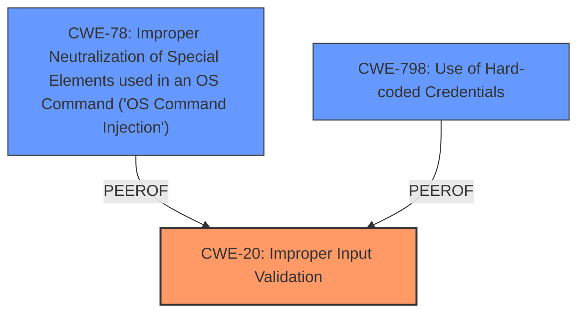

# Raw Analyzer Response for CVE-2025-20158

# Summary
| CWE ID | CWE Name | Confidence | CWE Abstraction Level | CWE Vulnerability Mapping Label | CWE-Vulnerability Mapping Notes |
|---|---|---|---|---|---|
| CWE-20 | Improper Input Validation | 1.0 | Class | Primary | Allowed |
| CWE-798 | Use of Hard-coded Credentials | 0.5 | Base | Secondary | Allowed |
| CWE-78 | Improper Neutralization of Special Elements used in an OS Command ('OS Command Injection') | 0.5 | Base | Secondary | Allowed |

## Evidence and Confidence

*   **Confidence Score:** 0.8
*   **Evidence Strength:** HIGH

## Relationship Analysis
The primary relationship influencing my decision is the parent-child relationship where CWE-20 is a class-level CWE. The vulnerability description focuses on **insufficient validation of user-supplied input**, directly aligning with the definition of CWE-20. Although the description mentions access to sensitive information, the root cause stems from the **lack of proper input validation**, making CWE-20 the most appropriate primary classification. CWE-78 and CWE-798 are secondary considerations because crafted input could lead to OS command injection or exposure of hardcoded credentials, but these are potential consequences of the **improper input validation**, not the root cause itself.

## Vulnerability Chain
The vulnerability chain starts with **insufficient validation of user-supplied input** (CWE-20). This **lack of validation** allows an attacker to send a crafted SSH client command. This can then potentially lead to OS Command Injection (CWE-78) or exposure of Hard-coded Credentials (CWE-798), ultimately resulting in access to sensitive information.

## Summary of Analysis
Based on the vulnerability description, the primary weakness is the **insufficient validation of user-supplied input**. This aligns directly with CWE-20, which is defined as "The product receives input or data, but it does not validate or incorrectly validates that the input has the properties that are required to process the data safely and correctly."

The description states, "This vulnerability is due to **insufficient validation of user-supplied input** by the debug shell of an affected device." This provides direct evidence for classifying the vulnerability as CWE-20. The potential for OS Command Injection (CWE-78) and Use of Hard-coded Credentials (CWE-798) are secondary considerations, as they are potential consequences of the **improper input validation**. The attacker exploits the **lack of validation** by sending a crafted SSH client command, which could then lead to further exploitation.

The choice of CWE-20 is at the Class level because the description does not provide enough information to determine the specific type of input validation that is missing or incorrect. Therefore, a more specific Base or Variant CWE cannot be selected with confidence.

Other CWEs considered but not used:

*   CWE-798: Use of Hard-coded Credentials - This was considered, but the root cause is more directly related to **improper input validation** rather than the use of hard-coded credentials.
*   CWE-78: Improper Neutralization of Special Elements used in an OS Command ('OS Command Injection') - This was considered as a potential consequence, but again, the root cause is the **lack of proper input validation**.
*   CWE-284: Improper Access Control - The vulnerability description does not indicate an access control issue as the primary weakness.
*   CWE-138: Improper Neutralization of Special Elements - Similar to CWE-78, this is a potential consequence, but not the root cause.
*   CWE-321: Use of Hard-coded Cryptographic Key - This is a specific case of CWE-798 and not directly indicated in the description as the root cause.