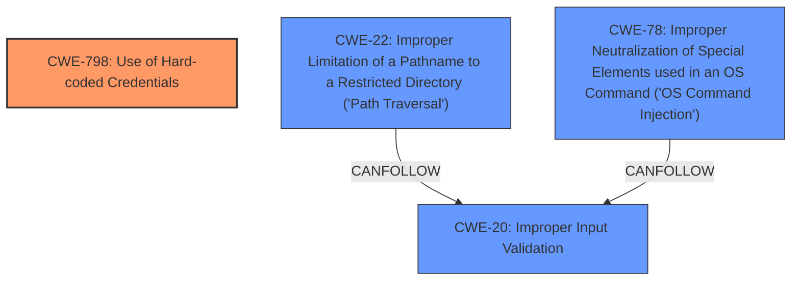

# Analysis Report for CVE-2025-20188

# Vulnerability Analysis Report: CVE-2025-20188

## Description

A vulnerability in the Out-of-Band Access Point (AP) Image Download, the Clean Air Spectral Recording, and the client debug bundles features of Cisco IOS XE Software for Wireless LAN Controllers (WLCs) could allow an unauthenticated, remote attacker to upload arbitrary files to an affected system. This vulnerability is due to the presence of a **hard-coded JSON Web Token (JWT)** on an affected system. An attacker could exploit this vulnerability by sending crafted HTTPS requests to the AP file upload interface. A successful exploit could allow the attacker to upload files, perform **path traversal**, and execute arbitrary commands with root privileges.

## Vulnerability Description Key Phrases

- **Rootcause:** hard-coded JSON Web Token (JWT)
- **Weakness:** path traversal
- **Impact:** ['execute arbitrary commands with root privileges', 'upload files']
- **Vector:** crafted HTTPS requests to the AP file upload interface
- **Attacker:** unauthenticated remote attacker
- **Product:** Cisco IOS XE Software for Wireless LAN Controllers (WLCs)
- **Component:** ['client debug bundles features', 'Clean Air Spectral Recording', 'AP Image Download']

## Analysis (with Relationship Data)

# Summary
| CWE ID | CWE Name | Confidence | CWE Abstraction Level | CWE Vulnerability Mapping Label | CWE-Vulnerability Mapping Notes |
|---|---|---|---|---|---|
| CWE-798 | Use of Hard-coded Credentials | 1.0 | Base | Primary | Allowed |
| CWE-22 | Improper Limitation of a Pathname to a Restricted Directory ('Path Traversal') | 0.9 | Base | Secondary Candidate | Allowed |
| CWE-78 | Improper Neutralization of Special Elements used in an OS Command ('OS Command Injection') | 0.8 | Base | Secondary Candidate | Allowed |

## Evidence and Confidence

*   **Confidence Score:** 0.9
*   **Evidence Strength:** HIGH

## Relationship Analysis
The primary weakness is the **hard-coded credentials** which is CWE-798. There is also a **path traversal** weakness which is CWE-22 and an OS Command injection weakness which is CWE-78. CWE-22 can follow CWE-20 (Improper Input Validation), which isn't the primary weakness but could be related. CWE-78 can follow CWE-20 (Improper Input Validation). These relationships help understand how the initial **hard-coded JWT** can lead to further vulnerabilities.



## Vulnerability Chain
1.  **Root Cause:** **CWE-798 Use of Hard-coded Credentials**. A **hard-coded JWT** is present in the system.
2.  **Weakness:** **CWE-22 Improper Limitation of a Pathname to a Restricted Directory ('Path Traversal')**. This allows attackers to access unauthorized directories and files.
3.  **Weakness:** **CWE-78 Improper Neutralization of Special Elements used in an OS Command ('OS Command Injection')**. Attackers can execute arbitrary commands.
4.  **Impact:** Arbitrary file upload and execution of arbitrary commands with root privileges.

## Summary of Analysis
The primary root cause is the **hard-coded JWT**, which allows an attacker to bypass authentication and perform actions they shouldn't be able to. The evidence for this is strong, as both the vulnerability description and the CVE reference links explicitly mention the **hard-coded JWT** as the root cause. Specifically, the "CVE Reference Links Content Summary" section states: "The vulnerability is due to the presence of a hard-coded JSON Web Token (JWT) on an affected system." The subsequent **path traversal** (CWE-22) and command injection (CWE-78) are consequences of this initial flaw, as the attacker can leverage the JWT to upload files and execute commands.

CWE-798 (Use of Hard-coded Credentials) is the most appropriate primary CWE because it directly addresses the root cause. The other weaknesses, **path traversal** and command injection, stem from this initial flaw. The other listed CWEs in the Retriever Results were considered, but they represent contributing factors or potential impacts rather than the core issue. For instance, CWE-20 (Improper Input Validation) might be related to the **path traversal** vulnerability, but the **hard-coded JWT** is the primary enabler.

The selected CWEs are at the optimal level of specificity. CWE-798 is a Base level CWE, while CWE-22 and CWE-78 are also Base level CWEs. Using more generic Class or Pillar level CWEs would not accurately reflect the specific nature of the vulnerabilities.


## CWE Relationship Analysis

Current CWEs represent these abstraction levels: .


### Vulnerability Chain Analysis

**Chain starting from CWE-20:**
- 20 (Improper Input Validation) - ROOT


**Chain starting from CWE-798:**
- 798 (Use of Hard-coded Credentials) - ROOT


### CWE Relationship Diagram

```mermaid
graph TD
    classDef primary fill:#f96,stroke:#333,stroke-width:2px
    classDef secondary fill:#69f,stroke:#333
    classDef tertiary fill:#9e9,stroke:#333
```


*Report generated on 2025-07-14 08:24:31*
