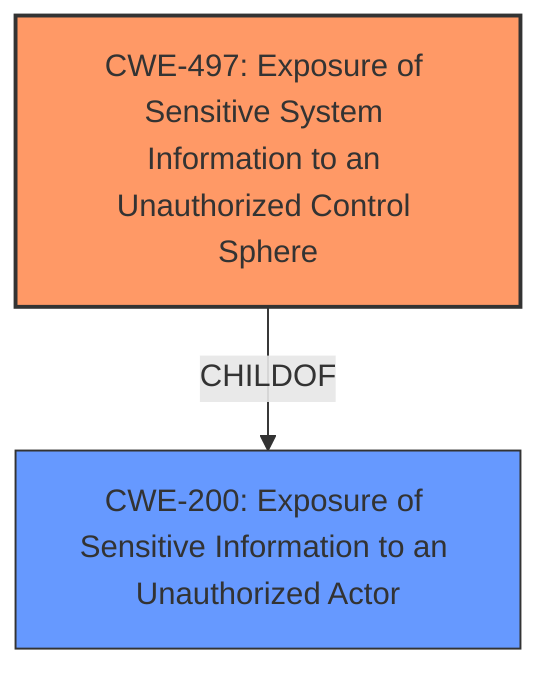

# Analysis for CVE-2025-20207

# Summary
| CWE ID | CWE Name | Confidence | CWE Abstraction Level | CWE Vulnerability Mapping Label | CWE-Vulnerability Mapping Notes |
|---|---|---|---|---|---|
| CWE-497 | Exposure of Sensitive System Information to an Unauthorized Control Sphere | 0.9 | Base | Allowed | Primary CWE |
| CWE-200 | Exposure of Sensitive Information to an Unauthorized Actor | 0.6 | Class | Discouraged | Secondary Candidate |

## Evidence and Confidence

*   **Confidence Score:** 0.8
*   **Evidence Strength:** HIGH

## Relationship Analysis
The primary relationship that influenced the decision was the parent-child relationship between CWE-200 and CWE-497. CWE-497 is a more specific child of CWE-200, focusing on the exposure of system-level information. The vulnerability description explicitly mentions "confidential information about the underlying operating system," which aligns well with the scope of CWE-497. Choosing CWE-497 provides a more granular classification than the broader CWE-200.

## Vulnerability Chain
The vulnerability chain starts with the **appliances not protecting confidential information at rest in response to SNMP poll requests**. This **weakness** leads to the exposure of sensitive system information when an attacker sends a crafted SNMP poll request, ultimately resulting in the attacker obtaining confidential information about the underlying operating system.

## Summary of Analysis
The initial analysis focused on identifying the root cause of the vulnerability, which is that the **appliances do not protect confidential information at rest**. The retriever results suggested several CWEs, including CWE-200, CWE-497, and CWE-798. However, based on the vulnerability description and the CVE reference link content summary, CWE-497 (Exposure of Sensitive System Information to an Unauthorized Control Sphere) is the most appropriate because it specifically addresses the exposure of system-level information, which aligns with the vulnerability's impact. CWE-200 is a broader category and is discouraged as per mapping guidance for being too general. CWE-798 (Use of Hard-coded Credentials) is not applicable as the vulnerability does not involve the use of hard-coded credentials. The final selection is based on the evidence provided, the relationship between CWEs, and the mapping guidance. The chosen CWE is at the optimal level of specificity, providing a clear and accurate representation of the vulnerability.

Relevant CWE Information:

# Enhanced Context (25 CWEs)
The following CWEs were identified as potentially relevant to this vulnerability:

## CWE-497: Exposure of Sensitive System Information to an Unauthorized Control Sphere
**Abstraction Level**: Base
**Similarity Score**: 0.76
**Source**: dense

**Description**:
The product does not properly prevent sensitive system-level information from being accessed by unauthorized actors who do not have the same level of access to the underlying system as the product does.

**Mapping Guidance**:
- Usage: Allowed
- Rationale: This CWE entry is at the Base level of abstraction, which is a preferred level of abstraction for mapping to the root causes of vulnerabilities.

**Technical Explanation:**
CWE-497 (Exposure of Sensitive System Information to an Unauthorized Control Sphere) is selected as the primary CWE because the vulnerability description states that the **appliances do not protect confidential information at rest in response to SNMP poll requests**, leading to the exposure of confidential information about the underlying operating system. This aligns directly with the CWE-497 description, which focuses on preventing unauthorized access to sensitive system-level information. The impact is that an attacker can discover restricted confidential information. CWE-497 is a Base level CWE, providing the right level of granularity. The mapping guidance allows for its use.

**CWE-200 Considerations:**
CWE-200 (Exposure of Sensitive Information to an Unauthorized Actor) was considered but not selected as the primary CWE because it is a broader category. While the vulnerability does involve the exposure of sensitive information, the specific type of information exposed (system-level information) makes CWE-497 a more accurate choice. Additionally, the mapping guidance discourages using CWE-200 when more specific options are available.