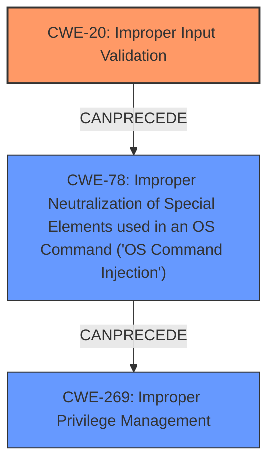

# Enhanced Analysis for CVE-2025-20256

# Summary
| CWE ID | CWE Name | Confidence | CWE Abstraction Level | CWE Vulnerability Mapping Label | CWE-Vulnerability Mapping Notes |
|---|---|---|---|---|---|
| CWE-20 | Improper Input Validation | 1.0 | Class | Primary | Allowed-with-Review |
| CWE-78 | Improper Neutralization of Special Elements used in an OS Command ('OS Command Injection') | 0.7 | Base | Secondary | Allowed |
| CWE-269 | Improper Privilege Management | 0.5 | Class | Secondary | Discouraged |

## Evidence and Confidence

*   **Confidence Score:** 0.8
*   **Evidence Strength:** HIGH

## Relationship Analysis
The primary relationship is that **CWE-20** Improper Input Validation can lead to **CWE-78** OS Command Injection. While **CWE-20** is a class-level CWE, it aligns with the root cause, and the provided information does not allow for a more specific input validation weakness to be selected. **CWE-269** Improper Privilege Management is related, as the successful exploitation leads to root privileges.



## Vulnerability Chain
The vulnerability chain starts with **CWE-20** Improper Input Validation, which allows an attacker to inject OS commands (**CWE-78**). This leads to the attacker gaining root privileges (**CWE-269**), allowing them to execute arbitrary commands on the system.

## Summary of Analysis
The initial analysis identified **CWE-20** Improper Input Validation as the primary root cause, supported by the vulnerability description stating "**insufficient input validation** in specific fields of the web-based management interface." The CVE Reference Links Content Summary further reinforces this by explicitly mentioning insufficient input validation as the root cause.

**CWE-78** Improper Neutralization of Special Elements used in an OS Command ('OS Command Injection') is a possible secondary weakness because the impact allows an attacker to execute arbitrary commands on the underlying operating system. This suggests that the **insufficient input validation** allows the attacker to inject OS commands.

**CWE-269** Improper Privilege Management is a possible secondary weakness because successful exploitation of the vulnerability allows the attacker to execute arbitrary commands on the underlying operating system with root privileges. This is a direct consequence of the successful exploitation.

The retriever results also listed **CWE-20** as the top candidate with a similarity score of 0.690.

Based on the evidence, relationship analysis, and retriever results, the following CWEs are selected:

*   **CWE-20** Improper Input Validation (Primary): This is the root cause of the vulnerability, as stated in the vulnerability description.
*   **CWE-78** Improper Neutralization of Special Elements used in an OS Command ('OS Command Injection') (Secondary): This is a consequence of the improper input validation.
*   **CWE-269** Improper Privilege Management (Secondary): The attacker gains root privileges, indicating a privilege management issue.

The selected CWEs are at the optimal level of specificity, given the information provided. While **CWE-20** is a class-level CWE, it accurately reflects the root cause, and there is no information to identify a more specific input validation weakness.


## CWE Relationship Analysis

Current CWEs represent these abstraction levels: .


### Vulnerability Chain Analysis

**Chain starting from CWE-269:**
- 269 (Improper Privilege Management) - ROOT


**Chain starting from CWE-78:**
- 78 (Improper Neutralization of Special Elements used in an OS Command ('OS Command Injection')) - ROOT


### CWE Relationship Diagram

```mermaid
graph TD
    classDef primary fill:#f96,stroke:#333,stroke-width:2px
    classDef secondary fill:#69f,stroke:#333
    classDef tertiary fill:#9e9,stroke:#333
```