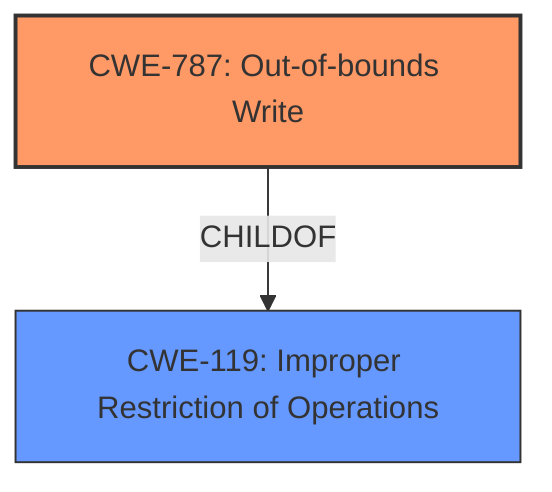

# Raw Analyzer Response for CVE-2025-2029

# Summary

| CWE ID  | CWE Name                                                                 | Confidence | CWE Abstraction Level | CWE Vulnerability Mapping Label | CWE-Vulnerability Mapping Notes |
| :-------- | :----------------------------------------------------------------------- | :---------- | :---------------------- | :------------------------------ | :-------------------------------- |
| CWE-787 | Out-of-bounds Write                                                    | 0.90       | Base                    | Primary                         | Allowed                           |
| CWE-119 | Improper Restriction of Operations within the Bounds of a Memory Buffer | 0.70       | Class                    | Secondary                       | Discouraged                        |

## Evidence and Confidence

*   **Confidence Score:** 0.80
*   **Evidence Strength:** MEDIUM

## Relationship Analysis

The primary relationship that influenced the decision was the parent-child relationship between CWE-787 (Out-of-bounds Write) and CWE-119 (Improper Restriction of Operations within the Bounds of a Memory Buffer), where CWE-787 is a more specific type of CWE-119. Since the vulnerability description mentions **memory corruption**, and CWE-787 directly addresses writing outside of buffer boundaries, it was selected as the primary CWE. CWE-119 was considered because it broadly covers memory buffer issues but is less specific.

## Vulnerability Chain

The vulnerability chain is relatively simple:

1.  **Root Cause:** An out-of-bounds write (**memory corruption**) occurs due to some **weakness** in the handling of data.
2.  **Impact:** **Memory corruption**, potentially leading to arbitrary code execution or other undefined behavior.

In this case, the description is limited, and it does not have a CVE Reference Links Content Summary.

## Summary of Analysis

Based on the limited evidence provided, the primary **weakness** is **memory corruption** due to an unknown cause within the mDicom.exe file of MicroDicom DICOM Viewer. The most suitable CWE is CWE-787 (Out-of-bounds Write) because it directly describes the act of writing data beyond the intended buffer. While CWE-119 (Improper Restriction of Operations within the Bounds of a Memory Buffer) is a related, more general category, CWE-787 offers a more precise classification of the **memory corruption** issue.

The Retriever Results also support the choice of CWE-787, with the highest score. The description lacks specific details about the root cause such as missing bounds checking or incorrect calculations.
The graph relationships influenced the selection by highlighting the parent-child relationship between CWE-787 and CWE-119, guiding the selection of the more specific CWE-787.

Other CWEs Considered:

*   CWE-125 (Out-of-bounds Read): This was considered but deemed less relevant because the vulnerability description explicitly mentions **memory corruption**, implying a write operation rather than a read.
*   CWE-190 (Integer Overflow or Wraparound): This was considered as a potential cause for the out-of-bounds write, but there is no direct evidence in the description to support this.
*   CWE-476 (NULL Pointer Dereference): This was considered but deemed less relevant because the vulnerability description explicitly mentions **memory corruption**, implying a write operation rather than dereferencing a null pointer.
*   CWE-120 (Buffer Copy without Checking Size of Input): While this could be a possibility, the lack of detail makes CWE-787 a more appropriate starting point.
*   CWE-704 (Incorrect Type Conversion or Cast): There is no information provided that is relevant to type conversion.

The chosen CWEs are at the optimal level of specificity given the limited information. More detail would be needed to choose a more specific variant.

Relevant CWE Information:

# Enhanced Context (25 CWEs)
The following CWEs were identified as potentially relevant to this vulnerability:

## CWE-787: Out-of-bounds Write
**Abstraction Level**: Base
**Similarity Score**: 0.68
**Source**: dense

**Description**:
The product writes data past the end, or before the beginning, of the intended buffer.

**Mapping Guidance**:
- Usage: Allowed
- Rationale: This CWE entry is at the Base level of abstraction, which is a preferred level of abstraction for mapping to the root causes of vulnerabilities.

## CWE-119: Improper Restriction of Operations within the Bounds of a Memory Buffer
**Abstraction Level**: Class
**Similarity Score**: 0.68
**Source**: dense

**Description**:
The product performs operations on a memory buffer, but it reads from or writes to a memory location outside the buffer's intended boundary. This may result in read or write operations on unexpected memory locations that could be linked to other variables, data structures, or internal program data.

**Mapping Guidance**:
- Usage: Discouraged
- Rationale: CWE-119 is commonly misused in low-information vulnerability reports when lower-level CWEs could be used instead, or when more details about the vulnerability are available.

## CWE-125: Out-of-bounds Read
**Abstraction Level**: Base
**Similarity Score**: 0.67
**Source**: dense

**Description**:
The product reads data past the end, or before the beginning, of the intended buffer.

**Mapping Guidance**:
- Usage: Allowed
- Rationale: This CWE entry is at the Base level of abstraction, which is a preferred level of abstraction for mapping to the root causes of vulnerabilities.

## CWE-704: Incorrect Type Conversion or Cast
**Abstraction Level**: Class
**Similarity Score**: 0.67
**Source**: dense

**Description**:
The product does not correctly convert an object, resource, or structure from one type to a different type.

**Mapping Guidance**:
- Usage: Allowed-with-Review
- Rationale: This CWE entry is a Class and might have Base-level children that would be more appropriate

## CWE-789: Memory Allocation with Excessive Size Value
**Abstraction Level**: Variant
**Similarity Score**: 0.66
**Source**: dense

**Description**:
The product allocates memory based on an untrusted, large size value, but it does not ensure that the size is within expected limits, allowing arbitrary amounts of memory to be allocated.

**Mapping Guidance**:
- Usage: Allowed
- Rationale: This CWE entry is at the Variant level of abstraction, which is a preferred level of abstraction for mapping to the root causes of vulnerabilities.

## CWE-200: Exposure of Sensitive Information to an Unauthorized Actor
**Abstraction Level**: Class
**Similarity Score**: 0.66
**Source**: dense

**Description**:
The product exposes sensitive information to an actor that is not explicitly authorized to have access to that information.

**Mapping Guidance**:
- Usage: Discouraged
- Rationale: CWE-200 is commonly misused to represent the loss of confidentiality in a vulnerability, but confidentiality loss is a technical impact - not a root cause error. As of CWE 4.9, over 400 CWE entries can lead to a loss of confidentiality. Other options are often available. [REF-1287].

## CWE-755: Improper Handling of Exceptional Conditions
**Abstraction Level**: Class
**Similarity Score**: 0.66
**Source**: dense

**Description**:
The product does not handle or incorrectly handles an exceptional condition.

**Mapping Guidance**:
- Usage: Discouraged
- Rationale: This CWE entry is a level-1 Class (i.e., a child of a Pillar). It might have lower-level children that would be more appropriate

## CWE-20: Improper Input Validation
**Abstraction Level**: Class
**Similarity Score**: 0.66
**Source**: dense

**Description**:
The product receives input or data, but it does
        not validate or incorrectly validates that the input has the
        properties that are required to process the data safely and
        correctly.

**Mapping Guidance**:
- Usage: Discouraged
- Rationale: CWE-20 is commonly misused in low-information vulnerability reports when lower-level CWEs could be used instead, or when more details about the vulnerability are available [REF-1287]. It is not useful for trend analysis. It is also a level-1 Class (i.e., a child of a Pillar).

## CWE-345: Insufficient Verification of Data Authenticity
**Abstraction Level**: Class
**Similarity Score**: 0.65
**Source**: dense

**Description**:
The product does not sufficiently verify the origin or authenticity of data, in a way that causes it to accept invalid data.

**Mapping Guidance**:
- Usage: Discouraged
- Rationale: This CWE entry is a level-1 Class (i.e., a child of a Pillar). It might have lower-level children that would be more appropriate