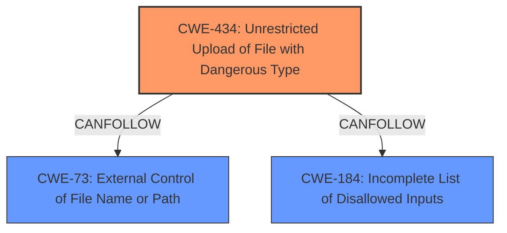

# Analysis Report for CVE-2025-2035

# Vulnerability Analysis Report: CVE-2025-2035

## Description

A vulnerability was found in s-a-zhd Ecommerce-Website-using-PHP 1.0 and classified as critical. Affected by this issue is some unknown functionality of the file /customer_register.php. The manipulation of the argument name leads to **unrestricted upload**. The attack may be launched remotely. The exploit has been disclosed to the public and may be used.

## Vulnerability Description Key Phrases

- **Weakness:** unrestricted upload
- **Product:** s-a-zhd Ecommerce-Website-using-PHP
- **Version:** 1.0
- **Component:** /customer_register.php

## Analysis (with Relationship Data)

# Summary
| CWE ID | CWE Name | Confidence | CWE Abstraction Level | CWE Vulnerability Mapping Label | CWE-Vulnerability Mapping Notes |
|---|---|---|---|---|---|
| CWE-434 | Unrestricted Upload of File with Dangerous Type | 1.0 | Base | Allowed | Primary CWE. The description clearly states "**unrestricted upload**" as the **weakness**, aligning perfectly with this CWE.|

## Evidence and Confidence

*   **Confidence Score:** 1.0
*   **Evidence Strength:** HIGH

## Relationship Analysis
The primary CWE is CWE-434, which is a base-level CWE. No parent or child relationships significantly impact this selection, as the evidence directly supports this CWE. There are CANFOLLOW relationships to CWE-73 (External Control of File Name or Path), CWE-184 (Incomplete List of Disallowed Inputs).



## Vulnerability Chain
The vulnerability chain starts with the **unrestricted upload** (**ROOTCAUSE**) which can lead to arbitrary code execution or other malicious activities depending on how the uploaded file is processed.

## Summary of Analysis
The analysis is based on the explicit mention of "**unrestricted upload**" in the vulnerability description, which directly corresponds to CWE-434 (Unrestricted Upload of File with Dangerous Type). This direct mapping provides high confidence.

CWE-434 is selected as the primary CWE because the vulnerability description explicitly mentions "**unrestricted upload**". This direct correspondence makes it the most accurate and specific CWE for the vulnerability.

Other CWEs Considered but Not Used:

*   CWE-89 (Improper Neutralization of Special Elements used in an SQL Command ('SQL Injection')): While SQL injection is a common vulnerability, there is no evidence in the description to support this.
*   CWE-79 (Improper Neutralization of Input During Web Page Generation ('Cross-site Scripting')): Similar to SQL injection, there is no evidence of XSS in the provided description.
*   CWE-73 (External Control of File Name or Path): This is related to file operations but is not the primary **weakness** described. The **unrestricted upload** is the core issue.
*   CWE-306 (Missing Authentication for Critical Function): While authentication might be related, the direct cause is the **unrestricted upload**, not the missing authentication itself.


## CWE Relationship Analysis

Current CWEs represent these abstraction levels: .


### Vulnerability Chain Analysis

**Chain starting from CWE-89:**
- 89 (Improper Neutralization of Special Elements used in an SQL Command ('SQL Injection')) - ROOT


**Chain starting from CWE-73:**
- 73 (External Control of File Name or Path) - ROOT


### CWE Relationship Diagram

```mermaid
graph TD
    classDef primary fill:#f96,stroke:#333,stroke-width:2px
    classDef secondary fill:#69f,stroke:#333
    classDef tertiary fill:#9e9,stroke:#333
```


*Report generated on 2025-07-14 08:32:17*
