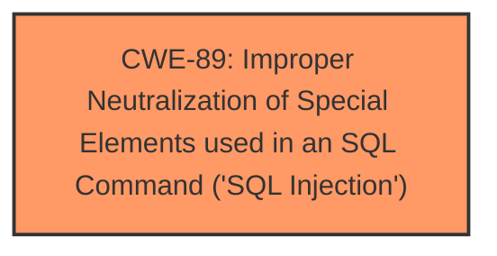

# Enhanced Analysis for CVE-2025-2041

# Summary
| CWE ID | CWE Name | Confidence | CWE Abstraction Level | CWE Vulnerability Mapping Label | CWE-Vulnerability Mapping Notes |
|---|---|---|---|---|---|
| CWE-89 | Improper Neutralization of Special Elements used in an SQL Command ('SQL Injection') | 1.0 | Base | Allowed | Primary CWE. The application constructs an SQL command using externally-influenced input without proper neutralization. |

## Evidence and Confidence

*   **Confidence Score:** 1.0
*   **Evidence Strength:** HIGH

## Relationship Analysis
The primary relationship influencing the CWE selection is the direct match of the vulnerability description to the definition of CWE-89. The description explicitly mentions "SQL injection" and the manipulation of an argument leading to this vulnerability. The evidence clearly supports CWE-89 as the root cause. There are no parent/child or chain relationships that strongly influence this selection, as the evidence points directly to the base weakness. The abstraction level of Base is appropriate as it directly represents the weakness.



## Vulnerability Chain
The vulnerability chain consists of:
1.  **Root Cause:** CWE-89 - Improper Neutralization of Special Elements used in an SQL Command ('SQL Injection'). The application fails to properly sanitize or neutralize input used in SQL queries.
2.  **Impact:** Potential data breach, data manipulation, authentication bypass, remote code execution, denial of service, privilege escalation, data exfiltration, and reputation damage.

## Summary of Analysis
The analysis is strongly based on the provided evidence. The vulnerability description explicitly mentions "SQL injection" and states that manipulation of the `p_cat` argument leads to this issue. The "CVE Reference Links Content Summary" confirms this by stating "The application source code is coded in a way which allows SQL Injection" and identifies `shop.php?p_cat=` as the vulnerable parameter.

The retriever results list CWE-89 as the top candidate with a score of 1.0, further reinforcing the selection. The relationship analysis is straightforward, as the evidence directly supports CWE-89. The other CWEs in the retriever results, such as CWE-79, CWE-434, and CWE-1336, are not applicable because the primary issue is related to the construction of SQL queries, not web page generation, file uploads, or template engines. The selected CWE is at the optimal level of specificity, as it directly describes the root cause of the vulnerability.

Relevant CWE Information:
*   **CWE-89: Improper Neutralization of Special Elements used in an SQL Command ('SQL Injection')**: The product constructs all or part of an SQL command using externally-influenced input from an upstream component, but it does not neutralize or incorrectly neutralizes special elements that could modify the intended SQL command when it is sent to a downstream component. This perfectly describes the vulnerability where manipulating the `p_cat` argument leads to SQL injection.


## CWE Relationship Analysis

Current CWEs represent these abstraction levels: .


### Vulnerability Chain Analysis

**Chain starting from CWE-89:**
- 89 (Improper Neutralization of Special Elements used in an SQL Command ('SQL Injection')) - ROOT


**Chain starting from CWE-79:**
- 79 (Improper Neutralization of Input During Web Page Generation ('Cross-site Scripting')) - ROOT


### CWE Relationship Diagram

```mermaid
graph TD
    classDef primary fill:#f96,stroke:#333,stroke-width:2px
    classDef secondary fill:#69f,stroke:#333
    classDef tertiary fill:#9e9,stroke:#333
```