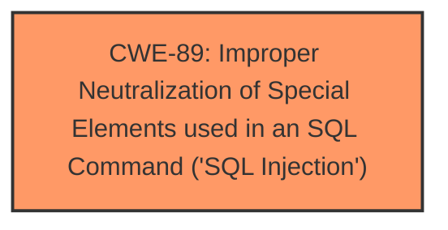

# Raw Analyzer Response for CVE-2025-2050

# Summary
| CWE ID | CWE Name | Confidence | CWE Abstraction Level | CWE Vulnerability Mapping Label | CWE-Vulnerability Mapping Notes |
|---|---|---|---|---|---|
| CWE-89 | Improper Neutralization of Special Elements used in an SQL Command ('SQL Injection') | 1.00 | Base | Allowed | Primary CWE |

## Evidence and Confidence

*   **Confidence Score:** 1.0
*   **Evidence Strength:** HIGH

## Relationship Analysis
The primary relationship influencing the decision is the direct match of the vulnerability description to the definition of CWE-89. There are no other relationships (parent-child, peer, or chain) that are relevant in this case, as the vulnerability is a straightforward SQL injection. The Base abstraction level is appropriate as it directly represents the **root cause** of the vulnerability.

## Vulnerability Chain
The vulnerability chain is simple: **Improper** neutralization of special elements in SQL commands (CWE-89) leads directly to unauthorized database access, sensitive data leakage, data tampering, comprehensive system control, and service interruption.

## Summary of Analysis
The analysis is based on the provided evidence, which clearly indicates an SQL injection vulnerability. The vulnerability description mentions "manipulation of the argument email leads to **sql injection**." The CVE Reference Links Content Summary confirms this, stating "Root cause of vulnerability: Insufficient user input validation of the 'password' parameter, allowing attackers to inject malicious SQL queries directly into SQL queries without proper cleaning or validation" and "Weaknesses/vulnerabilities present: SQL injection." The provided payload example also supports this conclusion.

The retriever results list CWE-89 as the top candidate, with a score of 1.00. The CWE description perfectly matches the vulnerability: "The product constructs all or part of an SQL command using externally-influenced input from an upstream component, but it does not neutralize or incorrectly neutralizes special elements that could modify the intended SQL command when it is sent to a downstream component."

The selection of CWE-89 is at the optimal level of specificity, as it directly addresses the **root cause** of the vulnerability.

**CWEs Considered But Not Used:**

*   CWE-79 (Improper Neutralization of Input During Web Page Generation ('Cross-site Scripting')): While input is not properly neutralized, the vulnerability is specifically an SQL Injection, not a Cross-Site Scripting issue.
*   CWE-434 (Unrestricted Upload of File with Dangerous Type): This CWE is not relevant as the vulnerability does not involve file uploads.
*   CWE-1336 (Improper Neutralization of Special Elements Used in a Template Engine): This CWE is not relevant as the vulnerability does not involve template engines.
*   CWE-352 (Cross-Site Request Forgery (CSRF)): This CWE is not relevant as the vulnerability is not a CSRF issue.
*   CWE-306 (Missing Authentication for Critical Function): This CWE is not relevant as the vulnerability is an SQL injection, not a missing authentication issue.
*   CWE-99 (Improper Control of Resource Identifiers ('Resource Injection')): This CWE is not relevant as the vulnerability is an SQL injection, not a resource injection issue.
*   CWE-287 (Improper Authentication): This CWE is not relevant as the vulnerability is an SQL injection, not a general authentication issue.
*   CWE-472 (External Control of Assumed-Immutable Web Parameter): This CWE is not relevant as the vulnerability is an SQL injection, not an immutable web parameter issue.
*   CWE-73 (External Control of File Name or Path): This CWE is not relevant as the vulnerability does not involve external control of file names or paths.