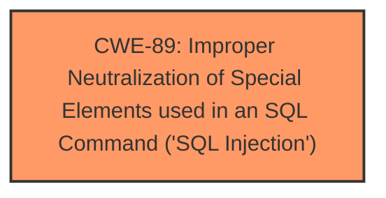

# Raw Analyzer Response for CVE-2025-2057

# Summary
| CWE ID | CWE Name | Confidence | CWE Abstraction Level | CWE Vulnerability Mapping Label | CWE-Vulnerability Mapping Notes |
|---|---|---|---|---|---|
| CWE-89 | Improper Neutralization of Special Elements used in an SQL Command ('SQL Injection') | 1.0 | Base | Primary | Allowed |

## Evidence and Confidence

*   **Confidence Score:** 1.0
*   **Evidence Strength:** HIGH

## Relationship Analysis
The primary identified CWE is CWE-89. This is a Base level CWE, which is appropriate as it directly describes the **SQL Injection** vulnerability. No parent-child or chain relationships are relevant in this simple case.

## Vulnerability Chain
The vulnerability chain is straightforward:
1.  **Root Cause:** CWE-89 - Improper Neutralization of Special Elements used in an SQL Command ('SQL Injection') due to **manipulation of the argument pagedes**.
2.  **Impact:** **SQL Injection**.

## Summary of Analysis
The vulnerability description clearly states that the **weakness** is **SQL Injection** due to the **manipulation of the argument pagedes** in the file `/admin/about-us.php`. The retriever results strongly suggest CWE-89 as the primary candidate, with a score of 1.0.

The evidence from the Vulnerability Description Key Phrases is:
- **weakness:** **sql injection**
- **vector:** manipulation of the argument pagedes

This directly matches the description of CWE-89: "The product constructs all or part of an SQL command using externally-influenced input from an upstream component, but it does not neutralize or incorrectly neutralizes special elements that could modify the intended SQL command when it is sent to a downstream component."

Other CWEs were considered from the retriever results, such as CWE-79 (Improper Neutralization of Input During Web Page Generation ('Cross-site Scripting')), CWE-434 (Unrestricted Upload of File with Dangerous Type), and CWE-1336 (Improper Neutralization of Special Elements Used in a Template Engine). However, these are not applicable because the vulnerability is specifically related to **SQL Injection**, not XSS, file upload, or template engine issues.