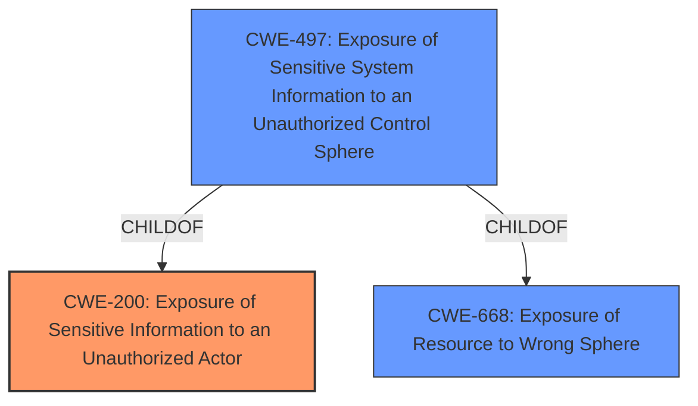

# Raw Analyzer Response for CVE-2025-20611

# Summary

| CWE ID | CWE Name | Confidence | CWE Abstraction Level | CWE Vulnerability Mapping Label | CWE-Vulnerability Mapping Notes |
|---|---|---|---|---|---|
| CWE-200 | Exposure of Sensitive Information to an Unauthorized Actor | 0.8 | Class | Primary CWE | Discouraged, but appropriate given the available evidence and the explicit mention of "Exposure of sensitive information to an unauthorized actor." |
| CWE-497 | Exposure of Sensitive System Information to an Unauthorized Control Sphere | 0.6 | Base | Secondary Candidate | Allowed |
| CWE-668 | Exposure of Resource to Wrong Sphere | 0.5 | Class | Secondary Candidate | Discouraged |

## Evidence and Confidence

*   **Confidence Score:** 0.7
*   **Evidence Strength:** MEDIUM

## Relationship Analysis

The primary relationship to consider is that CWE-200 [Exposure of Sensitive Information to an Unauthorized Actor] is a Class-level CWE. While typically discouraged, its direct match to the vulnerability description's key phrases and the CVE summary makes it a reasonable choice in this case, given the limited information. CWE-497 [Exposure of Sensitive System Information to an Unauthorized Control Sphere] is a more specific Base CWE, but it's not explicitly stated whether the exposed information is system-level. CWE-668 [Exposure of Resource to Wrong Sphere] is a high-level Class, also less specific than the description details.

## Vulnerability Chain

The vulnerability chain is relatively simple:

1.  **Root Cause:** The **exposure of sensitive information** due to an unspecified coding or configuration error.
2.  **Impact:** Information Disclosure.

The chain begins with the **exposure of sensitive information** and directly results in information disclosure. More information is needed to determine the exact weakness that caused this **exposure of sensitive information**.

## Summary of Analysis

The primary classification is CWE-200 [Exposure of Sensitive Information to an Unauthorized Actor] due to the explicit mention of "**exposure of sensitive information to an unauthorized actor**" in both the Vulnerability Description Key Phrases and the CVE Reference Links Content Summary. While CWE-200 is a Class-level CWE and generally discouraged, the evidence directly supports its use. Without more details about the root cause, a more specific CWE cannot be confidently assigned.

CWE-497 [Exposure of Sensitive System Information to an Unauthorized Control Sphere] was considered as a more specific alternative, given it is a Base CWE. However, the description doesn't explicitly state that the exposed information is "system-level," so it was not selected as primary.

CWE-668 [Exposure of Resource to Wrong Sphere] was also considered, but it's a high-level Class and less specific.

The decision to use CWE-200 is primarily based on the direct textual match in the vulnerability description. The graph relationships show that CWE-200 is a parent of CWE-497, but without additional context, the parent is the more appropriate choice.

Relevant CWE Information:
*   The **root cause of vulnerability:** **Exposure of sensitive information**.
*   **Weaknesses/vulnerabilities present:** **Exposure of sensitive information to an unauthorized actor**.