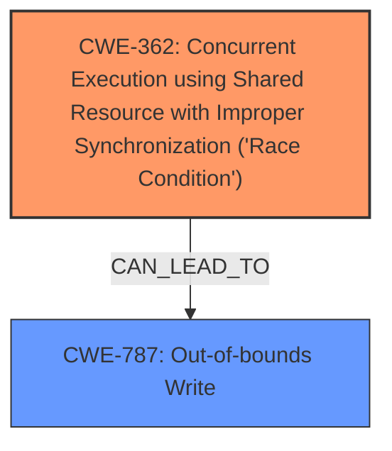

# Analysis for CVE-2025-20671

# Summary

| CWE ID  | CWE Name                                                                                             | Confidence | CWE Abstraction Level | CWE Vulnerability Mapping Label | CWE-Vulnerability Mapping Notes |
| :-------- | :--------------------------------------------------------------------------------------------------- | :--------- | :---------------------- | :------------------------------ | :------------------------------ |
| CWE-362   | Concurrent Execution using Shared Resource with Improper Synchronization ('**Race Condition**')       | 1.0        | Class                   | Primary CWE                   | Allowed-with-Review           |
| CWE-787   | **Out-of-bounds Write**                                                                                   | 1.0        | Base                    | Secondary Candidate             | Allowed                         |

## Evidence and Confidence

*   **Confidence Score:** 1.0
*   **Evidence Strength:** HIGH

## Relationship Analysis

The primary weakness is a **race condition** (CWE-362), which can lead to an **out-of-bounds write** (CWE-787). CWE-362 is a Class-level CWE, while CWE-787 is a Base-level CWE. There isn't a direct parent-child relationship between these CWEs, but a **race condition** can certainly lead to an **out-of-bounds write** if not properly handled. The **race condition** allows an attacker to manipulate a shared resource in a way that causes a write operation to occur outside the intended memory bounds.

## Vulnerability Chain

The vulnerability chain starts with a **race condition** (CWE-362). This **race condition** allows a malicious actor with System privilege to cause an **out-of-bounds write** (CWE-787), which can lead to local escalation of privilege.

## Summary of Analysis

The vulnerability description clearly states that the root cause is a **race condition** and the weakness is an **out-of-bounds write**. The "CVE Reference Links Content Summary" confirms this.

CWE-362 (Concurrent Execution using Shared Resource with Improper Synchronization ('**Race Condition**')) is selected as the primary CWE because it directly reflects the root cause of the vulnerability. The retriever results also lists CWE-362 as the top combined result.

CWE-787 (**Out-of-bounds Write**) is selected as a secondary CWE because it represents the direct consequence of the **race condition** and the resulting weakness.

The selected CWEs are at the optimal level of specificity, with CWE-362 being a Class and CWE-787 being a Base.

Other CWEs considered but not used:

*   CWE-667 (Improper Locking): While related to concurrency issues, the description specifically mentions a **race condition**, making CWE-362 a more accurate fit than a generic locking issue.
*   CWE-367 (Time-of-check Time-of-use (TOCTOU) **Race Condition**): This is a specific type of **race condition**. More evidence would be needed to determine if this is a TOCTOU vulnerability. Since the general **race condition** is mentioned, CWE-362 is a better fit.
*   CWE-266 (Incorrect Privilege Assignment), CWE-250 (Execution with Unnecessary Privileges), CWE-285 (Improper Authorization): While the impact is local escalation of privilege, the root cause is not related to privilege assignment, unnecessary privileges, or improper authorization, so these CWEs do not apply.
*   CWE-782 (Exposed IOCTL with Insufficient Access Control): This is not directly related to IOCTL, and more specific information about the root cause is necessary before it can be considered.

Relevant CWE Information:

**CWE-362: Concurrent Execution using Shared Resource with Improper Synchronization ('Race Condition')**
*   The product contains a concurrent code sequence that requires temporary, exclusive access to a shared resource, but a timing window exists in which the shared resource can be modified by another code sequence operating concurrently.
*   This CWE is selected because the vulnerability description explicitly mentions a **race condition** as the root cause.

**CWE-787: Out-of-bounds Write**
*   The product writes data past the end, or before the beginning, of the intended buffer. This typically occurs when the code does not check the size of the data before copying it to a fixed-length buffer.
*   This CWE is selected because the vulnerability description explicitly mentions **out of bounds write** as the weakness.