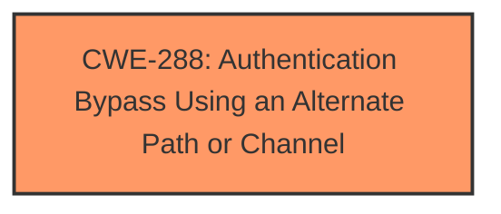

# Analysis Report for CVE-2025-20895

# Vulnerability Analysis Report: CVE-2025-20895

## Description

**Authentication Bypass Using an Alternate Path** in Galaxy Store prior to version 4.5.87.6 allows physical attackers to install arbitrary applications to bypass restrictions of Setupwizard.

## Vulnerability Description Key Phrases

- **Weakness:** Authentication Bypass Using an Alternate Path
- **Impact:** install arbitrary applications
- **Attacker:** physical attackers
- **Product:** Galaxy Store
- **Version:** prior to version 4.5.87.6

## Analysis (with Relationship Data)

# Summary
| CWE ID | CWE Name | Confidence | CWE Abstraction Level | CWE Vulnerability Mapping Label | CWE-Vulnerability Mapping Notes |
|---|---|---|---|---|---|
| CWE-288 | Authentication Bypass Using an Alternate Path or Channel | 1.0 | Base | Allowed | Primary CWE. The vulnerability description and CVE summary explicitly mention "Authentication Bypass Using an Alternate Path". |

## Evidence and Confidence

*   **Confidence Score:** 1.0
*   **Evidence Strength:** HIGH

## Relationship Analysis
The primary CWE, CWE-288, is a base-level CWE, which aligns with the guidance to select the most specific CWE possible. This CWE directly addresses the vulnerability described, where authentication is bypassed using an alternate path. This aligns with the definition of CWE-288, where the product requires authentication, but there is an alternate path that does not.



## Vulnerability Chain
The vulnerability chain starts with **Authentication Bypass Using an Alternate Path** (CWE-288), leading to the impact of physical attackers being able to install arbitrary applications.
  - **Root Cause:** CWE-288: Authentication Bypass Using an Alternate Path or Channel
  - **Impact:** Installation of arbitrary applications, bypassing Setupwizard restrictions.

## Summary of Analysis
The analysis is based on the direct evidence from the vulnerability description and the CVE summary, which explicitly mentions "**Authentication Bypass Using an Alternate Path**". The Retriever Results also list CWE-288 as the top candidate. The mapping guidance allows for the use of CWE-288, as it is at the Base level of abstraction.

The selected CWE is at the optimal level of specificity because it directly describes the root cause of the vulnerability, which is the authentication bypass through an alternate path. Other CWEs were considered but deemed less appropriate because they did not directly address the specific mechanism of the vulnerability.

Relevant CWE Information:

# Enhanced Context (25 CWEs)
The following CWEs were identified as potentially relevant to this vulnerability:

## CWE-288: Authentication Bypass Using an Alternate Path or Channel
**Abstraction Level**: Base
**Similarity Score**: 0.76
**Source**: dense

**Description**:
The product requires authentication, but the product has an alternate path or channel that does not require authentication.

**Mapping Guidance**:
- Usage: Allowed
- Rationale: This CWE entry is at the Base level of abstraction, which is a preferred level of abstraction for mapping to the root causes of vulnerabilities.


## CWE Relationship Analysis

Current CWEs represent these abstraction levels: .


### Vulnerability Chain Analysis

**Chain starting from CWE-288:**
- 288 (Authentication Bypass Using an Alternate Path or Channel) - ROOT


### CWE Relationship Diagram

```mermaid
graph TD
    classDef primary fill:#f96,stroke:#333,stroke-width:2px
    classDef secondary fill:#69f,stroke:#333
    classDef tertiary fill:#9e9,stroke:#333
```


*Report generated on 2025-07-14 08:45:19*
