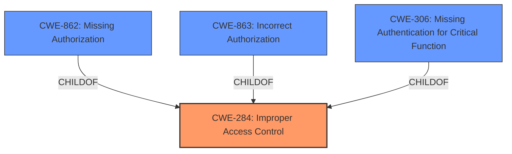

# Enhanced Analysis for CVE-2025-20897

# Summary
| CWE ID | CWE Name | Confidence | CWE Abstraction Level | CWE Vulnerability Mapping Label | CWE-Vulnerability Mapping Notes |
|---|---|---|---|---|---|
| CWE-284 | Improper Access Control | 0.75 | Pillar | Allowed-with-Review | The description clearly indicates an access control issue, but lacks the specificity to pinpoint the exact nature (authentication vs. authorization). |

## Evidence and Confidence

*   **Confidence Score:** 0.75
*   **Evidence Strength:** MEDIUM

## Relationship Analysis
The primary relationship that influenced the decision was the parent-child relationship between CWE-284 (Improper Access Control) and its children, such as CWE-862 (Missing Authorization), CWE-863 (Incorrect Authorization), and CWE-306 (Missing Authentication for Critical Function). While the vulnerability description points to an access control issue, it lacks the specificity to determine whether it's due to missing authentication, missing authorization, or incorrect authorization. Since the provided information isn't granular enough, the higher-level CWE-284 is chosen.



## Vulnerability Chain
The vulnerability chain is relatively simple:
1.  **Root Cause:** **Improper access control** (CWE-284)
2.  **Impact:** Local attacker can access data in Secure Folder.

## Summary of Analysis
The initial assessment was based on the vulnerability description stating "**Improper access control**" as the root cause. The retriever results also pointed towards CWEs related to access control and authorization. However, a closer look revealed that the description lacks specific details to differentiate between authentication and authorization issues.

The decision to use CWE-284 is primarily based on the high-level nature of the vulnerability description. The description mentions "**Improper access control**" but does not elaborate on whether the issue is related to missing authentication, missing authorization, or incorrect authorization. The "**Root cause of vulnerability: Improper access control**" from the CVE Reference Links Content Summary reinforces this.

Given this lack of specificity, selecting a more specific CWE like CWE-862 or CWE-306 would be inappropriate. Therefore, CWE-284, which represents a general access control issue, is the most suitable choice based on the available evidence.


## CWE Relationship Analysis

Current CWEs represent these abstraction levels: .


### Vulnerability Chain Analysis

**Chain starting from CWE-284:**
- 284 (Improper Access Control) - ROOT


**Chain starting from CWE-863:**
- 863 (Incorrect Authorization) - ROOT


### CWE Relationship Diagram

```mermaid
graph TD
    classDef primary fill:#f96,stroke:#333,stroke-width:2px
    classDef secondary fill:#69f,stroke:#333
    classDef tertiary fill:#9e9,stroke:#333
```