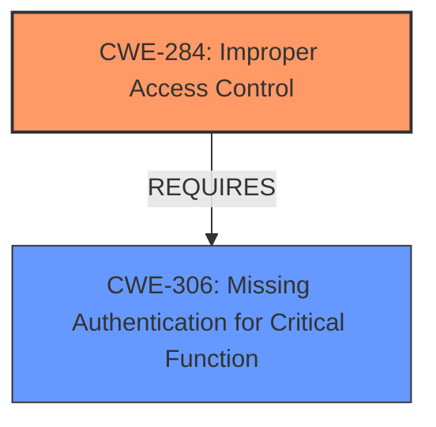

# Analysis Report for CVE-2025-2090

# Vulnerability Analysis Report: CVE-2025-2090

## Description

A vulnerability was found in PHPGurukul Pre-School Enrollment System 1.0 and classified as critical. Affected by this issue is some unknown functionality of the file /admin/add-subadmin.php of the component Sub Admin Handler. The manipulation leads to **improper access controls**. The attack may be launched remotely. The exploit has been disclosed to the public and may be used.

## Vulnerability Description Key Phrases

- **Rootcause:** improper access controls
- **Product:** PHPGurukul Pre-School Enrollment System
- **Version:** 1.0
- **Component:** /admin/add-subadmin.php of the component Sub Admin Handler

## Analysis (with Relationship Data)

# Summary
| CWE ID | CWE Name | Confidence | CWE Abstraction Level | CWE Vulnerability Mapping Label | CWE-Vulnerability Mapping Notes |
|---|---|---|---|---|---|
| CWE-284 | Improper Access Control | 1 | Base | Primary | Allowed |
| CWE-306 | Missing Authentication for Critical Function | 0.7 | Base | Secondary | Allowed |

## Evidence and Confidence

*   **Confidence Score:** 0.9
*   **Evidence Strength:** HIGH

## Relationship Analysis
The primary weakness is **improper access control** (CWE-284), which is a fundamental security flaw. The vulnerability occurs because the system **lacks verification of user session identity**, allowing low-privileged users to add sub-administrators. This is related to **missing authentication** (CWE-306) since proper authentication would establish the user's identity before granting privileges.



## Vulnerability Chain
The vulnerability chain starts with the **lack of user session identity verification**, which leads to **missing authentication**. This **missing authentication** directly causes the **improper access control**, allowing unauthorized users to perform administrative actions.

`Missing Authentication` -> `Improper Access Control` -> `Unauthorized User Creation` -> `Information Leakage and Management Risks`

## Summary of Analysis
The primary CWE is CWE-284 (Improper Access Control). The vulnerability description and the CVE reference summary clearly state that the root cause is the **improper access controls** due to the **lack of verification of user session identity**. This allows low-privileged users to perform actions they should not be authorized to do, such as adding sub-administrators. CWE-306 (Missing Authentication for Critical Function) is a secondary CWE, as the **missing authentication** is a prerequisite for the **improper access control** to occur.

The evidence for CWE-284 is found in the "Vulnerability Description Key Phrases" section, which states: "**rootcause:** **improper access controls**". Further evidence is in the "CVE Reference Links Content Summary" section, which states: "due to the **lack of verification of user session identity** in request verification, resulting in low privileged users being able to successfully send requests to add sub administrators directly."

The abstraction level for both CWE-284 and CWE-306 is Base, which is the preferred level.

Other CWEs Considered:
*   CWE-425 (Direct Request ('Forced Browsing')): Similar to CWE-284, but CWE-284 more directly addresses the **improper access control**.
*   CWE-639 (Authorization Bypass Through User-Controlled Key): Not applicable because the vulnerability does not involve modification of a key value.
*   CWE-306 (Missing Authentication for Critical Function): Considered as a secondary CWE because the **lack of authentication** is a prerequisite for the **improper access control**.
*   CWE-89 (Improper Neutralization of Special Elements used in an SQL Command ('SQL Injection')): Not relevant, as there is no mention of SQL injection in the description.
*   CWE-79 (Improper Neutralization of Input During Web Page Generation ('Cross-site Scripting')): Not relevant, as there is no mention of cross-site scripting in the description.
*   CWE-434 (Unrestricted Upload of File with Dangerous Type): Not relevant, as there is no mention of file uploads in the description.
*   CWE-73 (External Control of File Name or Path): Not relevant, as there is no mention of file name or path manipulation in the description.


## CWE Relationship Analysis

Current CWEs represent these abstraction levels: .


### Vulnerability Chain Analysis

**Chain starting from CWE-89:**
- 89 (Improper Neutralization of Special Elements used in an SQL Command ('SQL Injection')) - ROOT


**Chain starting from CWE-639:**
- 639 (Authorization Bypass Through User-Controlled Key) - ROOT


### CWE Relationship Diagram

```mermaid
graph TD
    classDef primary fill:#f96,stroke:#333,stroke-width:2px
    classDef secondary fill:#69f,stroke:#333
    classDef tertiary fill:#9e9,stroke:#333
```


*Report generated on 2025-07-14 08:46:10*
