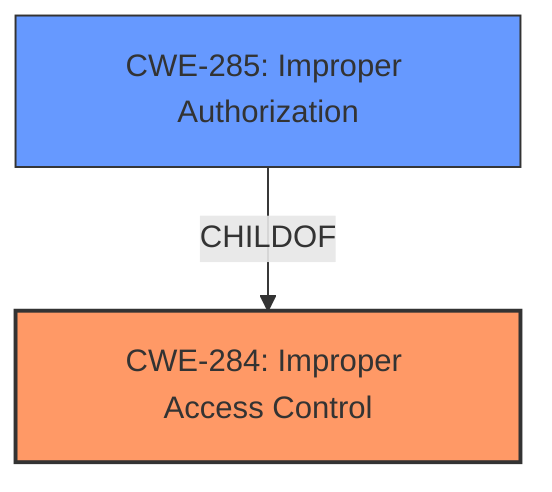

# Analysis Report for CVE-2025-20903

# Vulnerability Analysis Report: CVE-2025-20903

## Description

**Improper access control** in SecSettingsIntelligence prior to SMR Mar-2025 Release 1 allows local attackers to launch privileged activities. User interaction is required for triggering this vulnerability.

## Vulnerability Description Key Phrases

- **Rootcause:** Improper access control
- **Product:** SecSettingsIntelligence
- **Impact:** launch privileged activities, User interaction is required for triggering this vulnerability
- **Attacker:** local attackers
- **Version:** prior to SMR Mar-2025 Release 1

## Analysis (with Relationship Data)

# Summary
| CWE ID | CWE Name | Confidence | CWE Abstraction Level | CWE Vulnerability Mapping Label | CWE-Vulnerability Mapping Notes |
|---|---|---|---|---|---|
| CWE-284 | Improper Access Control | 0.8 | Pillar | Allowed | Primary CWE |
| CWE-285 | Improper Authorization | 0.6 | Class | Discouraged | Secondary Candidate |

## Evidence and Confidence

*   **Confidence Score:** 0.8
*   **Evidence Strength:** MEDIUM

## Relationship Analysis
The primary CWE is CWE-284, which is a high-level category. CWE-285 is a child of CWE-284 and represents a more specific type of access control issue, namely authorization. Since the vulnerability description states "**Improper access control**", and the analysis indicates that if the issue is more specific to authorization flaws, CWE-285 would be a better choice, then we can consider that to be a candidate. However, without additional information to pinpoint that the **improper access control** is specifically related to authorization, it is safer to stay with the more general CWE-284.



## Vulnerability Chain
The vulnerability chain starts with **improper access control**, leading to the ability for local attackers to launch privileged activities, requiring user interaction.

## Summary of Analysis
The initial assessment and analysis indicate that the **improper access control** vulnerability in SecSettingsIntelligence allows local attackers to launch privileged activities. The retriever results and CWE guidance suggest considering CWE-284 (Improper Access Control) as the primary CWE. CWE-285 (Improper Authorization) is a potential secondary candidate because the issue might be specifically related to authorization flaws. However, without more specific details, it's safer to stay with the more general CWE-284. The selection of CWE-284 is at an appropriate level of specificity, given the information provided. The evidence is based on the vulnerability description and CVE reference links.

Relevant CWE Information:

# Enhanced Context (25 CWEs)
The following CWEs were identified as potentially relevant to this vulnerability:

## CWE-284: Improper Access Control
**Abstraction Level**: Pillar
**Similarity Score**: 0.161
**Source**: sparse

**Description**:
The software does not restrict access to resources (data, files, actions, etc.) to only the intended privileged actors (users, processes, etc.).

**Mapping Guidance**:
- Usage: Discouraged
- Rationale: CWE-284 is high-level and should only be used if a more specific access control issue cannot be identified.

## CWE-285: Improper Authorization
**Abstraction Level**: Class
**Similarity Score**: 0.161
**Source**: sparse

**Description**:
The product does not perform or incorrectly performs an authorization check when an actor attempts to access a resource or perform an action.

**Mapping Guidance**:
- Usage: Discouraged
- Rationale: CWE-285 is high-level and lower-level CWEs can frequently be used instead. It is a level-1 Class (i.e., a child of a Pillar).


## CWE Relationship Analysis

Current CWEs represent these abstraction levels: .


### Vulnerability Chain Analysis

**Chain starting from CWE-284:**
- 284 (Improper Access Control) - ROOT


**Chain starting from CWE-285:**
- 285 (Improper Authorization) - ROOT


### CWE Relationship Diagram

```mermaid
graph TD
    classDef primary fill:#f96,stroke:#333,stroke-width:2px
    classDef secondary fill:#69f,stroke:#333
    classDef tertiary fill:#9e9,stroke:#333
```


*Report generated on 2025-07-14 08:47:27*
