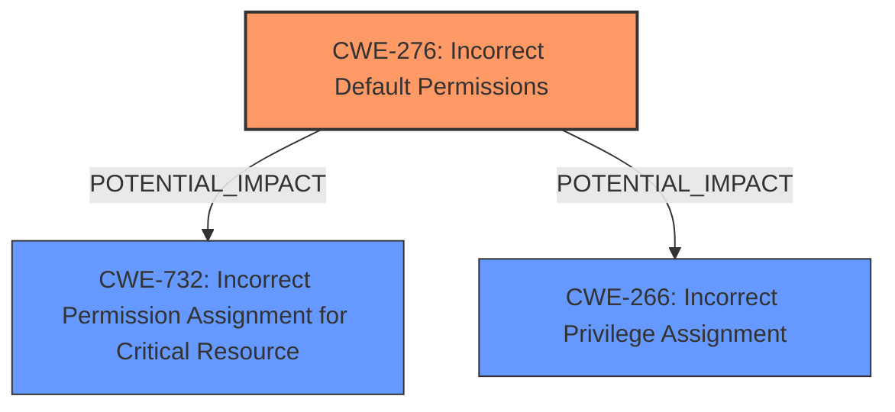

# Analysis for CVE-2025-20912

# Summary
| CWE ID | CWE Name | Confidence | CWE Abstraction Level | CWE Vulnerability Mapping Label | CWE-Vulnerability Mapping Notes |
|---|---|---|---|---|---|
| CWE-276 | Incorrect Default Permissions | 0.8 | Base | Allowed | Primary CWE |
| CWE-732 | Incorrect Permission Assignment for Critical Resource | 0.6 | Class | Allowed-with-Review | Secondary Candidate |
| CWE-266 | Incorrect Privilege Assignment | 0.5 | Base | Allowed | Secondary Candidate |

## Evidence and Confidence

*   **Confidence Score:** 0.8
*   **Evidence Strength:** HIGH

## Relationship Analysis
The primary relationship considered was the parent-child relationship. CWE-276 is a base-level CWE, providing a specific root cause. Other CWEs considered were higher-level classes, making CWE-276 the most specific and appropriate choice given the available evidence. The retriever results also point to related authorization and permission issues, which are considered as secondary candidates given the information available.

## Vulnerability Chain
The chain starts with **incorrect default permissions** (CWE-276), which leads to a critical resource having permissions assigned incorrectly (potentially CWE-732). The impact is that local attackers can access data within Galaxy Watch.

## Summary of Analysis
The vulnerability description clearly states "**Incorrect default permission**" as the root cause. The CVE Reference Links Content Summary reinforces this.

CWE-276 (Incorrect Default Permissions) is the most appropriate primary CWE because it directly addresses the root cause. Several other CWEs were considered but deemed less suitable:

*   CWE-285 (Improper Authorization): This is a broader category. While the vulnerability involves permissions, the root cause is the initial incorrect assignment, not a failure in the authorization check itself.
*   CWE-284 (Improper Access Control): Similar to CWE-285, this is too broad and doesn't capture the specific issue of incorrect default permissions.
*   CWE-732 (Incorrect Permission Assignment for Critical Resource): This is a potential secondary CWE. The **incorrect default permission** (CWE-276) likely results in the permissions for the critical resource being assigned incorrectly. It is a potential impact of the root cause.
*   CWE-266 (Incorrect Privilege Assignment): This CWE is related to privilege assignment. However, since the vulnerability description focuses on "permission," CWE-276 is more appropriate as the primary. It is possible that an incorrect permission leads to privilege escalation.

The guidance on Privileges vs Permissions emphasizes that permissions are access rules applied to resources and privileges are rights assigned to a user role. Here, the focus is on permissions related to accessing data, which is a resource.

The selection of CWE-276 is at the optimal level of specificity because it directly addresses the **root cause** stated in the vulnerability description.

Relevant CWE Information:

*   **CWE-276: Incorrect Default Permissions** - During installation, installed file permissions are set to allow anyone to modify those files. This is the most precise match for the stated root cause.

*   **CWE-732: Incorrect Permission Assignment for Critical Resource** - The product specifies permissions for a security-critical resource in a way that allows that resource to be read or modified by unintended actors.
*   **CWE-266: Incorrect Privilege Assignment** - A product incorrectly assigns a privilege to a particular actor, creating an unintended sphere of control for that actor.