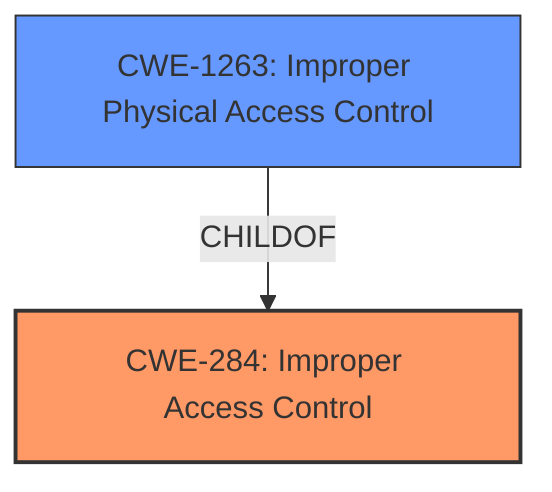

# Enhanced Analysis for CVE-2025-20924

# Summary
| CWE ID | CWE Name | Confidence | CWE Abstraction Level | CWE Vulnerability Mapping Label | CWE-Vulnerability Mapping Notes |
|---|---|---|---|---|---|
| CWE-284 | Improper Access Control | 0.8 | Pillar | Primary | Allowed |
| CWE-1263 | Improper Physical Access Control | 0.6 | Class | Secondary | Allowed-with-Review |

## Evidence and Confidence

*   **Confidence Score:** 0.8
*   **Evidence Strength:** MEDIUM

## Relationship Analysis
The primary CWE selected is CWE-284, which is a high-level category for access control issues. While less specific, it aligns with the provided information. The secondary CWE, CWE-1263, is more specific and related to physical access control, which is the attack vector described.



## Vulnerability Chain
The vulnerability chain begins with **improper access control** (CWE-284), leading to physical attackers gaining unauthorized access to data across multiple user profiles. The chain is:
1.  **Improper Access Control (CWE-284)**: The **root cause** is the lack of proper access control mechanisms within the application.
2.  **Physical Access (CWE-1263)**: Physical access allows an attacker to exploit the **improper access control**.
3.  **Data Access**: The final impact is the ability to access data across multiple user profiles.

## Summary of Analysis
The vulnerability description clearly states that there is **improper access control**, allowing physical attackers to access data across user profiles.

The primary mapping is CWE-284 (**Improper Access Control**), which aligns with the vulnerability description. This CWE is chosen because the vulnerability lies in the **improper access control** mechanisms within the Samsung Notes application. The "CVE Reference Links Content Summary" section explicitly states, "Root cause of vulnerability: **Improper access control**" and "Weaknesses/vulnerabilities present: **Improper access control**".

CWE-1263 (**Improper Physical Access Control**) is also considered since the vulnerability involves physical access to the device. However, it is a secondary consideration because the core weakness is the logical access control issue, not simply the physical access.

Other CWEs were considered but deemed less appropriate:

*   CWE-285 (**Improper Authorization**) and CWE-287 (**Improper Authentication**): These were not selected as the description does not provide information on authentication or authorization failures specifically. The issue is more general access control.
*   CWE-306 (**Missing Authentication for Critical Function**) is not applicable because the vulnerability is not about a complete lack of authentication.
*   CWE-862 (**Missing Authorization**) and CWE-863 (**Incorrect Authorization**): These are more specific authorization issues, but the provided description lacks the detail to determine whether the authorization process is missing or incorrect.

The selected CWEs are at the appropriate level of specificity based on the available information. CWE-284 is a general category, but it accurately represents the high-level weakness. CWE-1263 is a child of CWE-284 and provides more context.


## CWE Relationship Analysis

Current CWEs represent these abstraction levels: .


### Vulnerability Chain Analysis

**Chain starting from CWE-863:**
- 863 (Incorrect Authorization) - ROOT


**Chain starting from CWE-862:**
- 862 (Missing Authorization) - ROOT


### CWE Relationship Diagram

```mermaid
graph TD
    classDef primary fill:#f96,stroke:#333,stroke-width:2px
    classDef secondary fill:#69f,stroke:#333
    classDef tertiary fill:#9e9,stroke:#333
```