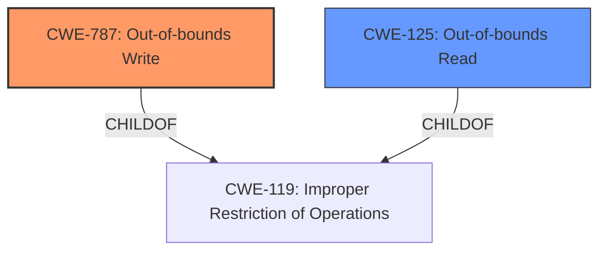

# Analysis for CVE-2025-20931

# Summary
| CWE ID  | CWE Name | Confidence | CWE Abstraction Level | CWE Vulnerability Mapping Label | CWE-Vulnerability Mapping Notes |
|----------------|----------------------------------------------------|----------------|--------------------------|-----------------------------------|------------------------------------|
| **CWE-787** | Out-of-bounds Write | 1.0 | Base | Allowed | Primary CWE. The vulnerability description explicitly states "out-of-bounds write". |
| CWE-125 | Out-of-bounds Read | 0.7 | Base | Allowed | Secondary candidate. The CVE reference link mentions "Out-of-bounds read" which may or may not be related to the primary issue. |

## Evidence and Confidence

*   **Confidence Score:** 1.0
*   **Evidence Strength:** HIGH

## Relationship Analysis
The primary relationship influencing the decision is the direct match of the vulnerability description to **CWE-787 (Out-of-bounds Write)**. While other CWEs like **CWE-125 (Out-of-bounds Read)** are also considered due to their presence in the CVE description and retriever results, the explicit mention of "out-of-bounds write" makes **CWE-787** the primary and most appropriate classification.

## Vulnerability Chain
The vulnerability chain starts with a flaw in the parsing of BMP images, leading to an **CWE-787 (Out-of-bounds Write)**. This allows local attackers to execute arbitrary code. The presence of **CWE-125 (Out-of-bounds Read)** in the CVE reference suggests a potential related vulnerability but is not as direct as the **CWE-787**.

## Summary of Analysis
The primary classification, **CWE-787 (Out-of-bounds Write)**, is directly supported by the vulnerability description, which explicitly mentions "out-of-bounds write". The retriever results also list this CWE with a high score. The CVE reference link mentions "Out-of-bounds read", which could indicate another weakness.

The selection is based on the provided evidence, specifically the vulnerability description. The graph relationships confirm the connection between **CWE-787** and its parent **CWE-119**, but the specificity of the description allows for the selection of the base CWE. **CWE-787** is at the optimal level of specificity, directly reflecting the nature of the vulnerability.

Relevant CWE Information:

# Enhanced Context (25 CWEs)

## CWE-125: Out-of-bounds Read
**Abstraction Level**: Base
**Similarity Score**: 0.68
**Source**: dense

**Description**:
The product reads data past the end, or before the beginning, of the intended buffer.

**Mapping Guidance**:
- Usage: Allowed
- Rationale: This CWE entry is at the Base level of abstraction, which is a preferred level of abstraction for mapping to the root causes of vulnerabilities.

Technical Explanation:
**CWE-787 (Out-of-bounds Write)**: This CWE describes a condition where the software writes data beyond the allocated buffer. In this case, while parsing a BMP image, the Samsung Notes application writes data past the intended buffer.
Security Implications: This can lead to arbitrary code execution, as the attacker can overwrite parts of memory that contain executable code or pointers to it.
Relationship Analysis: **CWE-787** is a base-level CWE and a child of **CWE-119 (Improper Restriction of Operations within the Bounds of a Memory Buffer)**.
Mapping Guidance Influence: The MITRE mapping guidance allows for the selection of this CWE.

**CWE-125 (Out-of-bounds Read)**: The product reads data past the end, or before the beginning, of the intended buffer. The CVE reference mentions "out-of-bounds read" which may or may not be related to the primary issue.
Security Implications: An out-of-bounds read can lead to information disclosure.
Relationship Analysis: **CWE-125** is a base-level CWE and a child of **CWE-119 (Improper Restriction of Operations within the Bounds of a Memory Buffer)**.
Mapping Guidance Influence: The MITRE mapping guidance allows for the selection of this CWE.