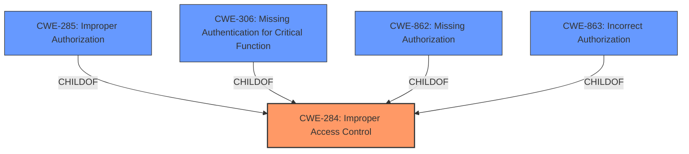

# Enhanced Analysis for CVE-2025-20934

# Summary
| CWE ID | CWE Name | Confidence | CWE Abstraction Level | CWE Vulnerability Mapping Label | CWE-Vulnerability Mapping Notes |
|---|---|---|---|---|---|
| CWE-284 | Improper Access Control | 0.9 | Pillar | Allowed | Primary CWE. Access control is a broad term including authentication and authorization. Given the root cause is **improper access control**, and without information to distinguish if it's an authentication or authorization issue, it's the most appropriate top-level classification. |

## Evidence and Confidence

*   **Confidence Score:** 0.9
*   **Evidence Strength:** HIGH

## Relationship Analysis
The primary relationship that influenced my decision was the hierarchical structure with CWE-284 as a high-level **Improper Access Control**, under which more specific authentication (CWE-306) and authorization (CWE-285, CWE-862, CWE-863) reside. Since the vulnerability description only mentions **improper access control**, mapping to the top-level CWE-284 is most appropriate. The other CWEs are more specific and require further evidence to justify their selection.



## Vulnerability Chain
The vulnerability chain here consists of the following steps:
1.  **Root Cause:** **Improper access control** in Sticker Center.
2.  **Impact:** Local attackers can access image files with system privilege.

## Summary of Analysis
The initial assessment focused on identifying the root cause of the vulnerability which is described as **improper access control**. The vulnerability description provides sufficient evidence to support this assessment. Given the high-level nature of the provided information, the most accurate and appropriate CWE is CWE-284. This is based on the "Authentication vs Authorization vs Access Control Guidance".

The vulnerability description explicitly states **"Improper access control"**.

The CWE-284 is at the optimal level of specificity because the description doesn't specify *how* the access control is improper, only that it *is* improper.
The official guidance for CWE-284 states that it is to be used "when access control failure exists but root cause is unclear" and that it should be avoided if "a more specific child CWE like 285, 862, 863, or 306 is appropriate." Since the description is very brief, and there is no other rootcause given, CWE-284 is appropriate.

Relevant CWE Information:
# Enhanced Context (25 CWEs)
The following CWEs were identified as potentially relevant to this vulnerability:

## CWE-266: Incorrect Privilege Assignment
**Abstraction Level**: Base
**Similarity Score**: 0.75
**Source**: dense

**Description**:
A product incorrectly assigns a privilege to a particular actor, creating an unintended sphere of control for that actor.

**Mapping Guidance**:
- Usage: Allowed
- Rationale: This CWE entry is at the Base level of abstraction, which is a preferred level of abstraction for mapping to the root causes of vulnerabilities.

**Why Not Selected:** While the impact of "access image files with system privilege" might suggest a privilege issue, the root cause is explicitly stated as "**improper access control**" not incorrect privilege assignment. Therefore, CWE-266 is not the primary CWE.

## CWE-267: Privilege Defined With Unsafe Actions
**Abstraction Level**: Base
**Similarity Score**: 0.75
**Source**: dense

**Description**:
A particular privilege, role, capability, or right can be used to perform unsafe actions that were not intended, even when it is assigned to the correct entity.

**Mapping Guidance**:
- Usage: Allowed
- Rationale: This CWE entry is at the Base level of abstraction, which is a preferred level of abstraction for mapping to the root causes of vulnerabilities.

**Why Not Selected:** The vulnerability description does not provide sufficient information to determine if a privilege is defined with unsafe actions. The root cause is identified as **improper access control**, and without additional details, CWE-267 is not applicable.

## CWE-280: Improper Handling of Insufficient Permissions or Privileges 
**Abstraction Level**: Base
**Similarity Score**: 0.74
**Source**: dense

**Description**:
The product does not handle or incorrectly handles when it has insufficient privileges to access resources or functionality as specified by their permissions. This may cause it to follow unexpected code paths that may leave the product in an invalid state.

**Mapping Guidance**:
- Usage: Allowed
- Rationale: This CWE entry is at the Base level of abstraction, which is a preferred level of abstraction for mapping to the root causes of vulnerabilities.

**Why Not Selected:** This CWE focuses on *insufficient* privileges. The vulnerability allows access "with system privilege", implying excessive, not insufficient, privilege.

## CWE-754: Improper Check for Unusual or Exceptional Conditions
**Abstraction Level**: Class
**Similarity Score**: 0.73
**Source**: dense

**Description**:
The product does not check or incorrectly checks for unusual or exceptional conditions that are not expected to occur frequently during day to day operation of the product.

**Mapping Guidance**:
- Usage: Allowed-with-Review
- Rationale: This CWE entry is a Class and might have Base-level children that would be more appropriate

**Why Not Selected:** The description specifies "**Improper access control**", not the handling of unusual conditions.

## CWE-274: Improper Handling of Insufficient Privileges
**Abstraction Level**: Base
**Similarity Score**: 0.73
**Source**: dense

**Description**:
The product does not handle or incorrectly handles when it has insufficient privileges to perform an operation, leading to resultant weaknesses.

**Mapping Guidance**:
- Usage: Discouraged
- Rationale: This CWE entry could be deprecated in a future version of CWE.

**Why Not Selected:** This CWE is about *insufficient* privileges. In this vulnerability, attackers gain access "with system privilege" indicating the problem is not about insufficient privileges.

## CWE-668: Exposure of Resource to Wrong Sphere
**Abstraction Level**: Class
**Similarity Score**: 0.73
**Source**: dense

**Description**:
The product exposes a resource to the wrong control sphere, providing unintended actors with inappropriate access to the resource.

**Mapping Guidance**:
- Usage: Discouraged
- Rationale: CWE-668 is high-level and is often misused as a catch-all when lower-level CWE IDs might be applicable. It is sometimes used for low-information vulnerability reports [REF-1287]. It is a level-1 Class (i.e., a child of a Pillar). It is not useful for trend analysis.

**Why Not Selected:** While the impact (accessing image files) could be interpreted as exposing a resource, the stated root cause is **improper access control**, making CWE-284 a more direct fit.

## CWE-345: Insufficient Verification of Data Authenticity
**Abstraction Level**: Class
**Similarity Score**: 0.73
**Source**: dense

**Description**:
The product does not sufficiently verify the origin or authenticity of data, in a way that causes it to accept invalid data.

**Mapping Guidance**:
- Usage: Discouraged
- Rationale: This CWE entry is a level-1 Class (i.e., a child of a Pillar). It might have lower-level children that would be more appropriate

**Why Not Selected:** This CWE is about data authenticity, which is not mentioned in the vulnerability description.

## CWE-41: Improper Resolution of Path Equivalence
**Abstraction Level**: Base
**Similarity Score**: 0.72
**Source**: dense

**Description**:
The product is vulnerable to file system contents disclosure through path equivalence. Path equivalence involves the use of special characters in file and directory names. The associated manipulations are intended to generate multiple names for the same object.

**Mapping Guidance**:
- Usage: Allowed
- Rationale: This CWE entry is at the Base level of abstraction, which is a preferred level of abstraction for mapping to the root causes of vulnerabilities.

**Why Not Selected:** There is no mention of path equivalence issues in the vulnerability description.

## CWE-667: Improper Locking
**Abstraction Level**: Class
**Similarity Score


## CWE Relationship Analysis

Current CWEs represent these abstraction levels: .


### Vulnerability Chain Analysis

**Chain starting from CWE-274:**
- 274 (Improper Handling of Insufficient Privileges) - ROOT


**Chain starting from CWE-863:**
- 863 (Incorrect Authorization) - ROOT


### CWE Relationship Diagram

```mermaid
graph TD
    classDef primary fill:#f96,stroke:#333,stroke-width:2px
    classDef secondary fill:#69f,stroke:#333
    classDef tertiary fill:#9e9,stroke:#333
```