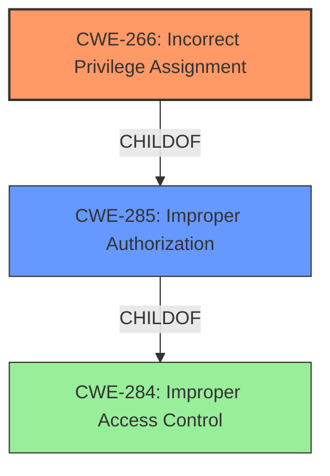

# Analysis for CVE-2025-20936

# Summary
| CWE ID    | CWE Name                                                    | Confidence | CWE Abstraction Level | CWE Vulnerability Mapping Label | CWE-Vulnerability Mapping Notes |
| :-------- | :---------------------------------------------------------- | :--------- | :-------------------- | :------------------------------ | :------------------------------ |
| CWE-266   | Incorrect Privilege Assignment                              | 0.85       | Base                  | Primary CWE                     | Allowed                       |
| CWE-285   | Improper Authorization                                      | 0.75       | Class                 | Secondary Candidate             | Discouraged                    |
| CWE-284   | Improper Access Control                                     | 0.65       | Pillar                | Secondary Candidate             | Discouraged                    |

## Evidence and Confidence

*   **Confidence Score:** 0.80
*   **Evidence Strength:** MEDIUM

## Relationship Analysis
The primary relationship influencing the decision is the hierarchical relationship between CWE-284 (Improper Access Control), CWE-285 (Improper Authorization) and CWE-266 (Incorrect Privilege Assignment). CWE-266 is chosen as the primary CWE because the vulnerability description explicitly mentions "**improper access control**" which results in privilege escalation, suggesting a misconfigured privilege. CWE-285 is a class-level CWE that represents a more general authorization issue, which is also a possibility. CWE-284 is a high-level category that's less specific and should be avoided if a more detailed child CWE is available.

## Vulnerability Chain
The vulnerability chain starts with the **improper access control** (CWE-266), which leads to the local attacker with shell privilege being able to escalate their privileges to root.
- The root cause is the **improper access control**, leading to incorrect privilege assignment.
- The impact is privilege escalation to root.

## Summary of Analysis
The initial analysis considered CWE-284 (Improper Access Control), CWE-285 (Improper Authorization), and CWE-266 (Incorrect Privilege Assignment). The guidance suggests that if a more specific child CWE is identifiable, then CWE-284 should be avoided.

The vulnerability description states "**Improper access control** in HDCP trustlet prior to SMR Apr-2025 Release 1 allows local attackers with shell privilege to escalate their privileges to root." This suggests that the system incorrectly assigned privileges, allowing a local attacker to escalate their privileges to root. Given the explicit mention of privilege escalation due to **improper access control**, CWE-266 (Incorrect Privilege Assignment) is chosen as the most appropriate CWE. The fix described in the CVE summary confirms this, stating "The patch adds proper access control."

The retriever results listed CWE-269 (Improper Privilege Management) as the top result, however, the mapping guidance for CWE-269 discourages its use because it can be conflated with privilege escalation and is not useful for trend analysis.

CWE-266 is at the optimal level of specificity as it directly addresses the root cause of the vulnerability: incorrect privilege assignment leading to privilege escalation.

Relevant CWE Information:

# Enhanced Context (25 CWEs)
The following CWEs were identified as potentially relevant to this vulnerability:

## CWE-266: Incorrect Privilege Assignment
**Abstraction Level**: Base
**Similarity Score**: 0.75
**Source**: dense

**Description**:
A product incorrectly assigns a privilege to a particular actor, creating an unintended sphere of control for that actor.

**Mapping Guidance**:
- Usage: Allowed
- Rationale: This CWE entry is at the Base level of abstraction, which is a preferred level of abstraction for mapping to the root causes of vulnerabilities.

## CWE-285: Improper Authorization
**Abstraction Level**: Class
**Similarity Score**: 2171.21
**Source**: sparse

**Description**:
The product does not perform or incorrectly performs an authorization check when an actor attempts to access a resource or perform an action.

**Mapping Guidance**:
- Usage: Discouraged
- Rationale: CWE-285 is high-level and lower-level CWEs can frequently be used instead. It is a level-1 Class (i.e., a child of a Pillar).

## CWE-284: Improper Access Control
**Abstraction Level**: Pillar
**Similarity Score**: 0.159
**Source**: sparse

**Description**:
The product does not adequately control access to resources or actions, which can have unintended consequences.

**Mapping Guidance**:
- Usage: Discouraged
- Rationale: This CWE entry is very high-level and should only be used when a more specific CWE is not available.