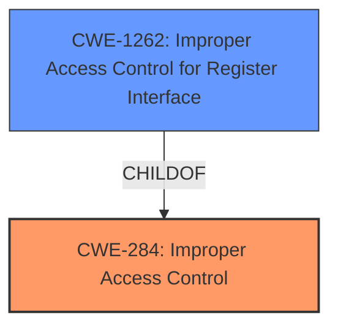

# Analysis for CVE-2025-20941

# Summary
| CWE ID | CWE Name | Confidence | CWE Abstraction Level | CWE Vulnerability Mapping Label | CWE-Vulnerability Mapping Notes |
|---|---|---|---|---|---|
| CWE-284 | Improper Access Control | 0.9 | Pillar | Primary | Allowed |
| CWE-1262 | Improper Access Control for Register Interface | 0.7 | Base | Secondary | Allowed |

## Evidence and Confidence

*   **Confidence Score:** 0.9
*   **Evidence Strength:** MEDIUM

## Relationship Analysis
The primary CWE is CWE-284, which is a high-level class. CWE-1262, a more specific base CWE, is related to improper access control for register interfaces, making it a potential secondary candidate. The relationship is that CWE-1262 is a child of CWE-284. The decision to use the higher-level CWE-284 is due to the limited details available.

## Vulnerability Chain
The vulnerability chain starts with **improper access control**, leading to local attackers being able to access the scancode of a specific input device.

## Summary of Analysis
The initial assessment identified **improper access control** as the root cause. The primary CWE selected is CWE-284, "Improper Access Control", because the description directly states this weakness. The evidence supporting this choice comes directly from the "Vulnerability Description Key Phrases" which states "**rootcause:** **Improper access control**". The CVE description also supports this. A secondary CWE of CWE-1262 "Improper Access Control for Register Interface" was also considered as it could apply to this vulnerability, but there isn't enough detail to confirm this. The final selection is based on the provided evidence, with the graph relationships supporting the choice of a more general CWE due to limited information.

Relevant CWE Information:

# Enhanced Context (25 CWEs)
The following CWEs were identified as potentially relevant to this vulnerability:

## CWE-284: Improper Access Control
**Abstraction Level**: Pillar
**Similarity Score**: 0.153
**Source**: sparse

**Description**:
The product does not restrict or incorrectly restricts access to resources (data, files, actions, memory locations, etc.) to only those actors that are authorized to use the resource.

**Mapping Guidance**:
- Usage: Discouraged
- Rationale: This is a very general category. More specific children are often available. This CWE is frequently used as a root cause in low-information vulnerability reports [REF-1287], which reduces its value.

## CWE-1262: Improper Access Control for Register Interface
**Abstraction Level**: base
**Similarity Score**: 0.595
**Source**: dense

**Description**:
CWE-1262: Improper Access Control for Register Interface

**Mapping Guidance**:
- Usage: Allowed
- Rationale: This CWE entry is at the Base level of abstraction, which is a preferred level of abstraction for mapping to the root causes of vulnerabilities.

**Relationships**:
- CHILDOF -> CWE-284
- PARENTOF -> CWE-1262

## Identification of CWEs
*   CWE-284 (Improper Access Control): This CWE is selected as the primary weakness because the vulnerability description explicitly mentions "**Improper access control**". The impact is that local attackers can access the scancode of specific input devices. This aligns with the description of CWE-284, which involves incorrect restriction of access to resources. However, the mapping guidance discourages its use due to its generality. Despite this discouragement, it is the most direct match to the provided information.
*   CWE-1262 (Improper Access Control for Register Interface): This CWE is considered as a secondary candidate because it is a more specific child of CWE-284 and relates to access control for register interfaces. However, without more information about the specifics of the vulnerability, it is difficult to definitively say that this CWE applies.

## Alternative CWEs Considered and Rejected:
*   CWE-285 (Improper Authorization), CWE-306 (Missing Authentication for Critical Function), CWE-862 (Missing Authorization), CWE-863 (Incorrect Authorization), CWE-287 (Improper Authentication): These CWEs are related to authorization and authentication issues, but the description explicitly mentions access control, making them less relevant.
*   CWE-476 (NULL Pointer Dereference), CWE-252 (Unchecked Return Value): These CWEs are unrelated to access control issues and are thus rejected.
*   CWE-639 (Authorization Bypass Through User-Controlled Key): The vulnerability doesn't explicitly mention a user-controlled key being the cause of the authorization bypass.
*   CWE-927 (Use of Implicit Intent for Sensitive Communication): The vulnerability doesn't appear to involve implicit intents or sensitive communication.
*   CWE-703 (Improper Check or Handling of Exceptional Conditions): This is too general and doesn't directly relate to access control.