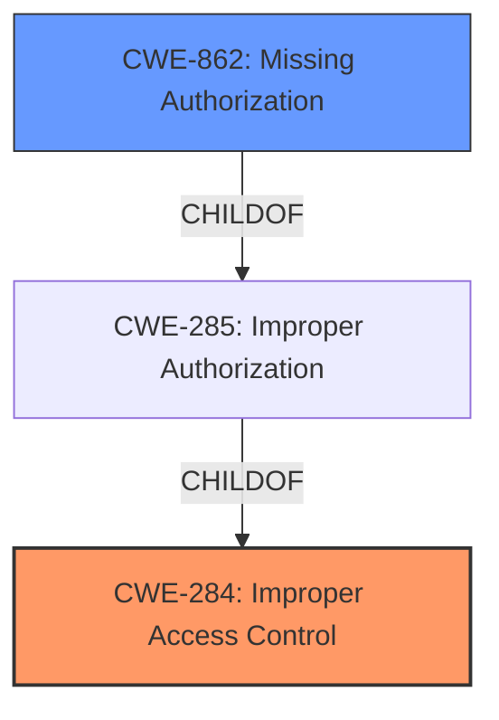

# Analysis Report for CVE-2025-20952

# Vulnerability Analysis Report: CVE-2025-20952

## Description

**Improper access control** in Mdecservice prior to SMR Apr-2025 Release 1 allows local attackers to access arbitrary files with system privilege.

## Vulnerability Description Key Phrases

- **Rootcause:** Improper access control
- **Impact:** access arbitrary files with system privilege
- **Attacker:** local attackers
- **Product:** Mdecservice
- **Version:** prior to SMR Apr-2025 Release 1

## Analysis (with Relationship Data)

# Summary
| CWE ID | CWE Name | Confidence | CWE Abstraction Level | CWE Vulnerability Mapping Label | CWE-Vulnerability Mapping Notes |
|---|---|---|---|---|---|
| CWE-284 | Improper Access Control | 0.9 | Pillar | Primary | Discouraged |
| CWE-862 | Missing Authorization | 0.6 | Class | Secondary | Allowed-with-Review |

## Evidence and Confidence

*   **Confidence Score:** 0.9
*   **Evidence Strength:** MEDIUM

## Relationship Analysis
The primary CWE is CWE-284, which is a high-level category used when the specific type of access control issue is unclear. Since the description indicates "**Improper access control**" without specifying whether authentication or authorization is missing or incorrect, CWE-284 is a reasonable starting point. However, given the guidance suggesting avoiding CWE-284 if a more specific child CWE exists, CWE-862 (Missing Authorization) is considered a secondary candidate. CWE-862 is a child of CWE-285 (Improper Authorization), and CWE-285 is a child of CWE-284.



## Vulnerability Chain
The vulnerability chain starts with **improper access control**, leading to local attackers being able to access arbitrary files with system privileges.
  - Root cause: **Improper access control**
  - Impact: Local attackers access arbitrary files with system privilege.

## Summary of Analysis
The initial assessment identifies **improper access control** as the root cause, aligning with CWE-284. The evidence from the vulnerability description key phrases explicitly states "**rootcause: Improper access control**". The CVE reference links content summary reinforces this by stating "**Root cause of vulnerability: Improper access control in Mdecservice**" and "**Weaknesses/vulnerabilities present: Improper access control**".

The choice of CWE-284 is influenced by the MITRE guidance, which suggests using it when the access control failure isn't clearly an authentication or authorization issue. Given the limited information, it's difficult to determine if the problem stems from missing authentication (CWE-306) or missing/incorrect authorization (CWE-862/863). If more information were available to indicate that the access control issue was due to missing authorization checks, CWE-862 would be a better fit. However, without that evidence, CWE-284 is the more appropriate, albeit generic, choice. The secondary candidate of CWE-862 is considered due to the possibility that the **improper access control** could be due to missing authorization.

Relevant CWE Information:

# Enhanced Context (25 CWEs)
The following CWEs were identified as potentially relevant to this vulnerability:

## CWE-284: Improper Access Control
**Abstraction Level**: Pillar
**Similarity Score**: 0.150
**Source**: sparse

**Description**:
The software does not restrict or incorrectly restricts access to resources (data, files, actions, etc.) to only the intended actor.

**Mapping Guidance**:
- Usage: Discouraged
- Rationale: This CWE entry is very high-level, a Pillar.

CWE-284 is selected as the primary CWE. The vulnerability description states that there is **improper access control**, which aligns with the description of CWE-284. The impact is that local attackers can access arbitrary files with system privilege.

## CWE-862: Missing Authorization
**Abstraction Level**: Class
**Similarity Score**: 1934.19
**Source**: sparse

**Description**:
The product does not perform an authorization check when an actor attempts to access a resource or perform an action.

**Mapping Guidance**:
- Usage: Allowed-with-Review
- Rationale: This CWE entry is a Class and might have Base-level children that would be more appropriate

CWE-862 is selected as a secondary CWE candidate. The vulnerability description states that there is **improper access control**, which *could* mean there is missing authorization.

# Summary
| CWE ID | CWE Name | Confidence | CWE Abstraction Level | CWE Vulnerability Mapping Label | CWE-Vulnerability Mapping Notes |
|---|---|---|---|---|---|
| CWE-284 | Improper Access Control | 0.9 | Pillar | Primary | Discouraged |
| CWE-862 | Missing Authorization | 0.6 | Class | Secondary | Allowed-with-Review |


## CWE Relationship Analysis

Current CWEs represent these abstraction levels: .


### Vulnerability Chain Analysis

**Chain starting from CWE-284:**
- 284 (Improper Access Control) - ROOT


**Chain starting from CWE-306:**
- 306 (Missing Authentication for Critical Function) - ROOT


### CWE Relationship Diagram

```mermaid
graph TD
    classDef primary fill:#f96,stroke:#333,stroke-width:2px
    classDef secondary fill:#69f,stroke:#333
    classDef tertiary fill:#9e9,stroke:#333
```


*Report generated on 2025-07-14 08:59:53*
