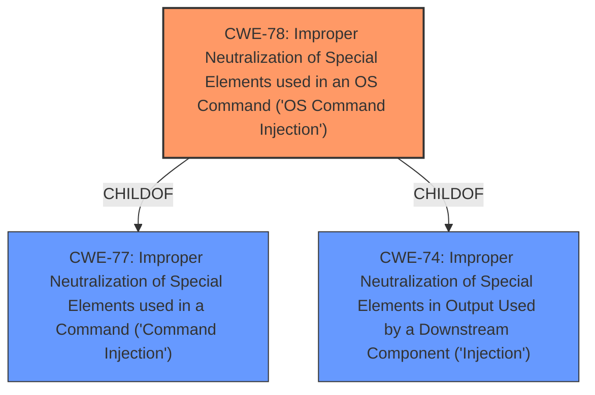

# Analysis for CVE-2025-2096

# Summary
| CWE ID | CWE Name | Confidence | CWE Abstraction Level | CWE Vulnerability Mapping Label | CWE-Vulnerability Mapping Notes |
|---|---|---|---|---|---|
| CWE-78 | Improper Neutralization of Special Elements used in an OS Command ('OS Command Injection') | 1.0 | Base | Allowed | Primary CWE |

## Evidence and Confidence

*   **Confidence Score:** 1.0
*   **Evidence Strength:** HIGH

## Relationship Analysis
The primary CWE is CWE-78, which is a Base level CWE. Several other CWEs were considered but deemed less appropriate. CWE-77 is a parent Class of CWE-78, making it less specific. Other CWEs like CWE-89 and CWE-79 are related to injection but are for SQL and XSS, respectively, and do not apply here.

## Vulnerability Chain
The vulnerability chain consists of:
1.  Improper handling of user-supplied input (`mode/week/minute/recHour`).
2.  Lack of proper neutralization of special elements.
3.  Execution of unintended OS commands due to the **OS command injection**.

The root cause is the **improper neutralization**, which leads directly to the impact of **OS command injection**.

## Summary of Analysis
The primary weakness, as stated in the vulnerability description, is **OS command injection**. The vulnerability occurs due to the manipulation of the `mode/week/minute/recHour` arguments. The `setRebootScheCfg` function in `/cgi-bin/cstecgi.cgi` is affected.

The most appropriate CWE is CWE-78 (Improper Neutralization of Special Elements used in an OS Command ('OS Command Injection')). This CWE accurately describes the vulnerability where externally influenced input is used to construct an OS command without proper neutralization of special elements.

The selection of CWE-78 is supported by the vulnerability description and the retriever results. The retriever lists CWE-78 as the top result with a score of 1.0. The description explicitly mentions "os command injection," aligning perfectly with CWE-78.

Other CWEs Considered:

*   CWE-77 (Improper Neutralization of Special Elements used in a Command ('Command Injection')): This is a more general class of command injection. Since the description specifies **OS command injection**, CWE-78 is a more precise fit.
*   CWE-89 (Improper Neutralization of Special Elements used in an SQL Command ('SQL Injection')): This is specific to SQL injection, which is not relevant to this vulnerability.
*   CWE-79 (Improper Neutralization of Input During Web Page Generation ('Cross-site Scripting')): This is specific to cross-site scripting, which is not relevant to this vulnerability.

The selection of CWE-78 is at the optimal level of specificity, as it directly addresses the root cause of the vulnerability, which is the **improper neutralization** leading to **OS command injection**. The evidence is strong, as the vulnerability description explicitly mentions **OS command injection**.