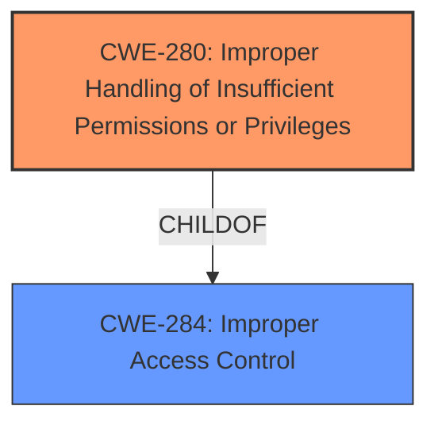

# Analysis for CVE-2025-20962

# Summary
| CWE ID | CWE Name | Confidence | CWE Abstraction Level | CWE Vulnerability Mapping Label | CWE-Vulnerability Mapping Notes |
|---|---|---|---|---|---|
| CWE-280 | Improper Handling of Insufficient Permissions or Privileges | 1.0 | Base | Primary | Allowed |
| CWE-284 | Improper Access Control | 0.5 | Pillar | Secondary | Discouraged |

## Evidence and Confidence

*   **Confidence Score:** 0.8
*   **Evidence Strength:** HIGH

## Relationship Analysis
The primary relationship is that CWE-280 is a more specific form of the high-level category CWE-284. CWE-280 directly addresses the **improper handling of insufficient permissions**, while CWE-284 is a broader categorization of **improper access control**. The selection of CWE-280 is favored due to the explicit mention of "insufficient permission" in the vulnerability description, making it a more precise fit than the general access control issue represented by CWE-284.

## Vulnerability Chain
The vulnerability chain begins with the **improper handling of insufficient permissions** (CWE-280). This leads to the impact of allowing local attackers to track the S Pen position.

CWE-280 (Root Cause) -> Impact: Tracking S Pen Position

## Summary of Analysis
The primary weakness, as indicated in the vulnerability description, is the **improper handling of insufficient permission**. This maps directly to CWE-280, which is at the Base level of abstraction and is ALLOWED for mapping. The evidence from the "Vulnerability Description Key Phrases" explicitly states: "**rootcause:** **Improper handling of insufficient permission**." The CVE Reference Links Content Summary also confirms this, stating: "Improper handling of insufficient permission in SpenGesture service." The retriever results also list CWE-280 at the top.

CWE-284 (Improper Access Control) was considered but deemed less specific. While the vulnerability could be seen as a form of improper access control, the root cause lies specifically in the handling of permissions, making CWE-280 a more accurate and descriptive classification. The MITRE guidance also says that CWE-284 is often overused and to use a more specific CWE if possible.

Relevant CWE Information:

# Enhanced Context (25 CWEs)
The following CWEs were identified as potentially relevant to this vulnerability:

## CWE-280: Improper Handling of Insufficient Permissions or Privileges
**Abstraction Level**: Base
**Similarity Score**: 0.79
**Source**: dense

**Description**:
The product does not handle or incorrectly handles when it has insufficient privileges to access resources or functionality as specified by their permissions. This may cause it to follow unexpected code paths that may leave the product in an invalid state.

**Mapping Guidance**:
- Usage: Allowed
- Rationale: This CWE entry is at the Base level of abstraction, which is a preferred level of abstraction for mapping to the root causes of vulnerabilities.

## CWE-284: Improper Access Control
**Abstraction Level**: Pillar
**Similarity Score**: 1261.31
**Source**: sparse

**Description**:
The product does not restrict or incorrectly restricts access to a resource from an unauthorized actor.

**Mapping Guidance**:
- Usage: Discouraged
- Rationale: CWE-284 is extremely high-level, a Pillar. Its name, "Improper Access Control," is often misused in low-information vulnerability reports [REF-1287] or by active use of the OWASP Top Ten, such as "A01:2021-Broken Access Control". It is not useful for trend analysis.