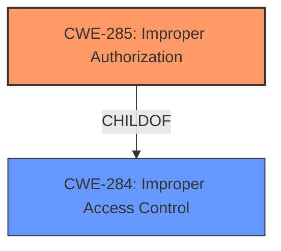

# Raw Analyzer Response for CVE-2025-20967

# Summary
| CWE ID | CWE Name | Confidence | CWE Abstraction Level | CWE Vulnerability Mapping Label | CWE-Vulnerability Mapping Notes |
|---|---|---|---|---|---|
| CWE-285 | Improper Authorization | 0.8 | Class |  | Allowed-with-Review, Primary CWE |

## Evidence and Confidence

*   **Confidence Score:** 0.8
*   **Evidence Strength:** HIGH

## Relationship Analysis
The primary CWE selected is CWE-285, "Improper Authorization." This CWE is a Class-level weakness. While more specific Base or Variant level CWEs could exist, the provided information is insufficient to pinpoint a more precise weakness. The guidance suggests that if the authorization logic exists but is flawed, CWE-285 is a good choice.

## Vulnerability Chain
The vulnerability chain starts with the **improper access control** (**CWE-285**) which leads to the ability of attackers to read and write arbitrary files. The root cause is the **improper authorization**, and the impact is arbitrary file access.

## Summary of Analysis
The vulnerability description clearly states that there is **improper access control** in Samsung Gallery. The CVE Reference Links Content Summary confirms that the **root cause of vulnerability** is **improper access control**.

The guidance provided emphasizes the distinction between authentication and authorization. Since the vulnerability involves controlling access to files *after* the user has been identified, it is an authorization issue. Given that the authorization is **improper**, CWE-285 is the most suitable choice.

The retriever results list several candidate CWEs, including CWE-269, CWE-284, CWE-285, and CWE-862.

*   CWE-269 (Improper Privilege Management) is **Discouraged**.
*   CWE-284 (Improper Access Control) is a high-level category and should be avoided if a more specific child CWE is appropriate.
*   CWE-862 (Missing Authorization) is for cases where there is *no* authorization check, which is not the case here.
*   CWE-285 (Improper Authorization) is a better fit, as it implies that an authorization check exists but is flawed.

The vulnerability description and CVE summary explicitly mention **improper access control**, aligning well with CWE-285.

Relevant CWE Information:

# Enhanced Context (25 CWEs)
The following CWEs were identified as potentially relevant to this vulnerability:

## CWE-285: Improper Authorization
**Abstraction Level**: Class
**Similarity Score**: 2430.65
**Source**: sparse

**Description**:
The product does not perform or incorrectly performs an authorization check when an actor attempts to access a resource or perform an action.

**Mapping Guidance**:
- Usage: Discouraged
- Rationale: CWE-285 is high-level and lower-level CWEs can frequently be used instead. It is a level-1 Class (i.e., a child of a Pillar).

## Complete CWE Specifications

CWE-285: Improper Authorization

The selected CWEs are at the optimal level of specificity given the available information. A more specific CWE would require a deeper understanding of the exact flaw in the authorization logic, which is not provided in the vulnerability description.