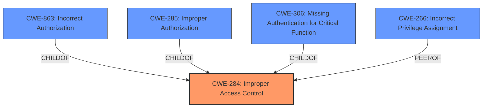

# Analysis Report for CVE-2025-20978

# Vulnerability Analysis Report: CVE-2025-20978

## Description

**Improper access control** in PENUP prior to version 3.9.19.32 allows local attackers to access files with PENUP privilege.

## Vulnerability Description Key Phrases

- **Rootcause:** Improper access control
- **Impact:** access files with PENUP privilege
- **Attacker:** local attackers
- **Product:** PENUP
- **Version:** prior to version 3.9.19.32

## Analysis (with Relationship Data)

# Summary
| CWE ID    | CWE Name                                                     | Confidence | CWE Abstraction Level | CWE Vulnerability Mapping Label | CWE-Vulnerability Mapping Notes |
| :-------- | :----------------------------------------------------------- | :--------- | :-------------------- | :------------------------------ | :------------------------------ |
| CWE-284   | Improper Access Control                                      | 0.9        | Pillar                | Primary                         | Discouraged                   |

## Evidence and Confidence

*   **Confidence Score:** 0.9
*   **Evidence Strength:** HIGH

## Relationship Analysis
The primary CWE selected is CWE-284, which is a high-level category. The analysis considered more specific children of CWE-284, such as CWE-863 (Incorrect Authorization), CWE-285 (Improper Authorization), and CWE-306 (Missing Authentication for Critical Function). However, the provided description lacks sufficient detail to pinpoint the exact cause of the access control issue, making CWE-284 the most appropriate choice. The analysis also considered CWE-266 (Incorrect Privilege Assignment), but it was determined that the given information was not detailed enough to make that specific assignment.



## Vulnerability Chain
The vulnerability chain starts with **Improper access control**, which allows local attackers to access files with PENUP privilege.

1.  **Root Cause:** **Improper access control** (CWE-284)
2.  **Impact:** Local attackers can access files with PENUP privilege

## Summary of Analysis
The initial analysis focused on identifying the root cause of the vulnerability based on the provided description and CVE reference. The description clearly states "**Improper access control**" as the root cause. The retriever results also pointed towards CWEs related to access control and authorization. The guidance provided about Authentication vs Authorization vs Access Control was pivotal in selecting CWE-284, as it is a general category for access control issues when the root cause is unclear.

The decision to use CWE-284 is primarily based on the explicit mention of "**Improper access control**" in the vulnerability description and CVE summary. While more specific CWEs like CWE-863 (Incorrect Authorization) or CWE-306 (Missing Authentication for Critical Function) could potentially apply, there is insufficient information to determine whether the issue is related to incorrect authorization checks or missing authentication. Therefore, opting for the broader CWE-284 is the most accurate representation of the vulnerability given the available evidence.
The selection of CWE-284 is at the optimal level of specificity because the available information does not allow for a more precise classification. Had there been details about missing authentication or flawed authorization logic, a more specific CWE would have been chosen. However, in the absence of such detail, CWE-284 adequately captures the essence of the access control failure.

Relevant CWE Information:

**CWE-284: Improper Access Control**
The product does not adequately control access to resources or functions, allowing unintended access.

CWEs Considered but Not Used:

*   CWE-863: Incorrect Authorization - Considered but not used because the description doesn't specify whether the authorization check was incorrect.
*   CWE-285: Improper Authorization - Considered but not used because the description doesn't specify whether the authorization was performed incorrectly.
*   CWE-306: Missing Authentication for Critical Function - Considered but not used because the description doesn't specify whether authentication was missing.
*   CWE-266: Incorrect Privilege Assignment - Considered but not used because the description doesn't provide enough information to determine if it's related to incorrect privilege assignment.


## CWE Relationship Analysis

Current CWEs represent these abstraction levels: .


### Vulnerability Chain Analysis

**Chain starting from CWE-863:**
- 863 (Incorrect Authorization) - ROOT


**Chain starting from CWE-306:**
- 306 (Missing Authentication for Critical Function) - ROOT


### CWE Relationship Diagram

```mermaid
graph TD
    classDef primary fill:#f96,stroke:#333,stroke-width:2px
    classDef secondary fill:#69f,stroke:#333
    classDef tertiary fill:#9e9,stroke:#333
```


*Report generated on 2025-07-14 09:04:40*
