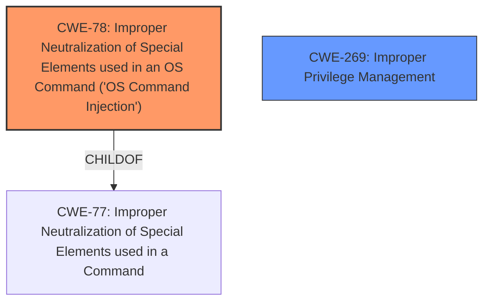

# Raw Analyzer Response for CVE-2025-21105

# Summary
| CWE ID | CWE Name | Confidence | CWE Abstraction Level | CWE Vulnerability Mapping Label | CWE-Vulnerability Mapping Notes |
|---|---|---|---|---|---|
| CWE-78 | Improper Neutralization of Special Elements used in an OS Command ('OS Command Injection') | 0.9 | Base | Allowed | Primary CWE. The root cause is the **command execution vulnerability**. |
| CWE-269 | Improper Privilege Management | 0.6 | Class | Discouraged | Secondary CWE. A low privileged user is able to perform administrative actions. |

## Evidence and Confidence

*   **Confidence Score:** 0.75
*   **Evidence Strength:** MEDIUM

## Relationship Analysis
The primary weakness is CWE-78 [Improper Neutralization of Special Elements used in an OS Command ('OS Command Injection')], which is a base level CWE. CWE-78 [Improper Neutralization of Special Elements used in an OS Command ('OS Command Injection')] is a child of CWE-77 [Improper Neutralization of Special Elements used in a Command]. The secondary weakness, CWE-269 [Improper Privilege Management], is a class level CWE, and is discouraged for use.

## Vulnerability Chain
The vulnerability chain starts with a **command execution vulnerability** (CWE-78 [Improper Neutralization of Special Elements used in an OS Command ('OS Command Injection')]) that allows a low-privileged user to perform administrative actions due to **improper privilege management** (CWE-269 [Improper Privilege Management]), ultimately leading to shutting down the server, modifying the configuration, and gaining access to unauthorized data.

## Summary of Analysis
The primary assessment is based on the provided evidence that indicates a **command execution vulnerability**. The description explicitly states that a low-privileged user can run a specific binary and perform administrative actions. This points towards CWE-78 [Improper Neutralization of Special Elements used in an OS Command ('OS Command Injection')] being the root cause because the system fails to properly neutralize special elements used in an OS command, allowing for command injection. This is further supported by the CVE Reference Links Content Summary.

CWE-269 [Improper Privilege Management] is considered a secondary weakness because the low-privileged user is able to perform administrative actions. While this is a contributing factor, the root cause is the command injection vulnerability that allows the user to escalate privileges.

The graph relationships influenced the selection by showing the hierarchical structure, with CWE-78 [Improper Neutralization of Special Elements used in an OS Command ('OS Command Injection')] being a more specific child of CWE-77 [Improper Neutralization of Special Elements used in a Command]. The selected CWEs are at the optimal level of specificity, with CWE-78 [Improper Neutralization of Special Elements used in an OS Command ('OS Command Injection')] being a base level CWE.