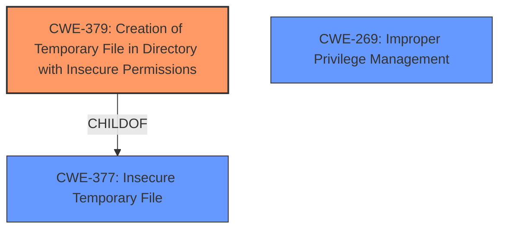

# Raw Analyzer Response for CVE-2025-21162

# Summary
| CWE ID | CWE Name | Confidence | CWE Abstraction Level | CWE Vulnerability Mapping Label | CWE-Vulnerability Mapping Notes |
|---|---|---|---|---|---|
| CWE-379 | Creation of Temporary File in Directory with Insecure Permissions | 1.0 | Base | Allowed | Primary CWE. The vulnerability description explicitly states this weakness. |
| CWE-269 | Improper Privilege Management | 0.5 | Class | Discouraged | Secondary candidate. Privilege escalation is mentioned, but the root cause is the insecure temporary file creation. |

## Evidence and Confidence

*   **Confidence Score:** 1.0
*   **Evidence Strength:** HIGH

## Relationship Analysis
The primary CWE, CWE-379, is a child of CWE-377 (Insecure Temporary File). The vulnerability involves creating a temporary file in a directory with incorrect permissions. This directly relates to CWE-379's definition. CWE-269 (Improper Privilege Management) is a Class-level CWE and a possible secondary consideration due to the impact of privilege escalation. However, CWE-379 is more specific and directly addresses the root cause. The low confidence in CWE-269 is because the description focuses on incorrect permissions on a temporary file, not general privilege management issues.

## Vulnerability Chain
The vulnerability chain starts with the **Creation of a Temporary File in a Directory with Incorrect Permissions (CWE-379)**, leading to the potential for a low-privileged user to escalate their privileges. The user interaction aspect is necessary for exploitation, highlighting the need for a malicious file to be opened.

## Summary of Analysis
The vulnerability is clearly described as a **Creation of Temporary File in Directory with Incorrect Permissions vulnerability**. The CVE Reference Links Content Summary confirms this by stating the **Root cause of vulnerability:** Creation of Temporary File in Directory with Incorrect Permissions and **Weaknesses/vulnerabilities present:** CWE-379 - Creation of Temporary File in Directory with Incorrect Permissions.

The description explicitly mentions privilege escalation as an impact. While related to privilege management, the root cause is specifically the insecure temporary file creation. Therefore, focusing on CWE-379 is more accurate.

The selected CWE is at the optimal level of specificity (Base) as it directly corresponds to the vulnerability's root cause. Other CWEs like CWE-732 (Incorrect Permission Assignment for Critical Resource) were considered but deemed less accurate because they are more general and don't specifically address the temporary file aspect. CWE-269 (Improper Privilege Management) was also considered due to the "privilege escalation" impact, but it is too high-level and doesn't represent the specific weakness.

Relevant CWE Information:
# Enhanced Context (25 CWEs)
The following CWEs were identified as potentially relevant to this vulnerability:

## CWE-266: Incorrect Privilege Assignment
Abstraction Level: Base
Similarity Score: 0.78
Source: dense

Description:
A product incorrectly assigns a privilege to a particular actor, creating an unintended sphere of control for that actor.

Mapping Guidance:
- Usage: Allowed
- Rationale: This CWE entry is at the Base level of abstraction, which is a preferred level of abstraction for mapping to the root causes of vulnerabilities.

## CWE-280: Improper Handling of Insufficient Permissions or Privileges
Abstraction Level: Base
Similarity Score: 0.76
Source: dense

Description:
The product does not handle or incorrectly handles when it has insufficient privileges to access resources or functionality as specified by their permissions. This may cause it to follow unexpected code paths that may leave the product in an invalid state.

Mapping Guidance:
- Usage: Allowed
- Rationale: This CWE entry is at the Base level of abstraction, which is a preferred level of abstraction for mapping to the root causes of vulnerabilities.

## CWE-59: Improper Link Resolution Before File Access ('Link Following')
Abstraction Level: Base
Similarity Score: 0.76
Source: dense

Description:
The product attempts to access a file based on the filename, but it does not properly prevent that filename from identifying a link or shortcut that resolves to an unintended resource.

Mapping Guidance:
- Usage: Allowed
- Rationale: This CWE entry is at the Base level of abstraction, which is a preferred level of abstraction for mapping to the root causes of vulnerabilities.

## CWE-276: Incorrect Default Permissions
Abstraction Level: Base
Similarity Score: 0.76
Source: dense

Description:
During installation, installed file permissions are set to allow anyone to modify those files.

Mapping Guidance:
- Usage: Allowed
- Rationale: This CWE entry is at the Base level of abstraction, which is a preferred level of abstraction for mapping to the root causes of vulnerabilities.

## CWE-267: Privilege Defined With Unsafe Actions
Abstraction Level: Base
Similarity Score: 0.76
Source: dense

Description:
A particular privilege, role, capability, or right can be used to perform unsafe actions that were not intended, even when it is assigned to the correct entity.

Mapping Guidance:
- Usage: Allowed
- Rationale: This CWE entry is at the Base level of abstraction, which is a preferred level of abstraction for mapping to the root causes of vulnerabilities.

## CWE-281: Improper Preservation of Permissions
Abstraction Level: Base
Similarity Score: 0.76
Source: dense

Description:
The product does not preserve permissions or incorrectly preserves permissions when copying, restoring, or sharing objects, which can cause them to have less restrictive permissions than intended.

Mapping Guidance:
- Usage: Allowed
- Rationale: This CWE entry is at the Base level of abstraction, which is a preferred level of abstraction for mapping to the root causes of vulnerabilities.

## CWE-274: Improper Handling of Insufficient Privileges
Abstraction Level: Base
Similarity Score: 0.75
Source: dense

Description:
The product does not handle or incorrectly handles when it has insufficient privileges to perform an operation, leading to resultant weaknesses.

Mapping Guidance:
- Usage: Discouraged
- Rationale: This CWE entry could be deprecated in a future version of CWE.

## CWE-41: Improper Resolution of Path Equivalence
Abstraction Level: Base
Similarity Score: 0.74
Source: dense

Description:
The product is vulnerable to file system contents disclosure through path equivalence. Path equivalence involves the use of special characters in file and directory names. The associated manipulations are intended to generate multiple names for the same object.

Mapping Guidance:
- Usage: Allowed
- Rationale: This CWE entry is at the Base level of abstraction, which is a preferred level of abstraction for mapping to the root causes of vulnerabilities.

## CWE-668: Exposure of Resource to Wrong Sphere
Abstraction Level: Class
Similarity Score: 0.74
Source: dense

Description:
The product exposes a resource to the wrong control sphere, providing unintended actors with inappropriate access to the resource.

Mapping Guidance:
- Usage: Discouraged
- Rationale: CWE-668 is high-level and is often misused as a catch-all when lower-level CWE IDs might be applicable. It is sometimes used for low-information vulnerability reports [REF-1287]. It is a level-1 Class (i.e., a child of a Pillar). It is not useful for trend analysis.

## CWE-552: Files or Directories Accessible to External Parties
Abstraction Level: Base
Similarity Score: 0.74
Source: dense

Description:
The product makes files or directories accessible to unauthorized actors, even though they should not be.

Mapping Guidance:
- Usage: Allowed
- Rationale: This CWE entry is at the Base level of abstraction, which is a preferred level of abstraction for mapping to the root causes of vulnerabilities.

## CWE-732: Incorrect Permission Assignment for Critical Resource
Abstraction Level: Class
Similarity Score: 1551.82
Source: sparse

Description:
The product specifies permissions for a security-critical resource in a way that allows that resource to be read or modified by unintended actors.

Mapping Guidance:
- Usage: Allowed-with-Review
- Rationale: While the name itself indicates an assignment of permissions for resources, this is often misused for vulnerabilities in which "permissions" are not checked, which is an "authorization" weakness (CWE-285 or descendants) within CWE's model [REF-1287].

## CWE-863: Incorrect Authorization
Abstraction Level: Class
Similarity Score: 1547.80
Source: sparse

Description:
The product performs an authorization check when an actor attempts to access a resource or perform an action, but it does not correctly perform the check.

Mapping Guidance:
- Usage: