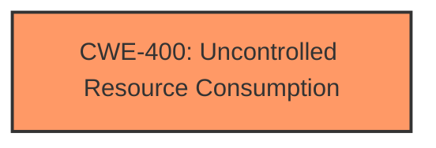

# Enhanced Analysis for CVE-2025-21174

# Summary
| CWE ID | CWE Name | Confidence | CWE Abstraction Level | CWE Vulnerability Mapping Label | CWE-Vulnerability Mapping Notes |
|---|---|---|---|---|---|
| CWE-400 | Uncontrolled Resource Consumption | 0.75 | Class | Allowed-with-Review | Primary CWE. The vulnerability directly states **"Uncontrolled resource consumption"**. |

## Evidence and Confidence

*   **Confidence Score:** 0.75
*   **Evidence Strength:** MEDIUM

## Relationship Analysis
The primary CWE is CWE-400, which is a Class-level CWE. While it has child CWEs, the provided information doesn't give enough specifics to go to a Base or Variant level.



## Vulnerability Chain
The chain starts with **uncontrolled resource consumption** (CWE-400) leading to a denial of service.

## Summary of Analysis
The vulnerability description explicitly mentions **"Uncontrolled resource consumption"**, making CWE-400 the most appropriate choice. While CWE-400 is a Class-level CWE, the lack of specific details prevents selecting a more granular Base or Variant CWE.

The assessment is heavily based on the provided vulnerability description, specifically the phrase **"Uncontrolled resource consumption"**. The relationship graph highlights that CWE-400 is a class-level weakness. The retriever results support this choice.

Relevant CWE Information:

# Enhanced Context (25 CWEs)
The following CWEs were identified as potentially relevant to this vulnerability:

## CWE-400: Uncontrolled Resource Consumption
**Abstraction Level**: Class
**Similarity Score**: 0.71
**Source**: dense

**Description**:
The product does not properly control the allocation and maintenance of a limited resource, thereby enabling an actor to influence the amount of resources consumed, eventually leading to the exhaustion of available resources.

**Mapping Guidance**:
- Usage: Discouraged
- Rationale: CWE-400 is intended for incorrect behaviors in which the product is expected to track and restrict how many resources it consumes, but CWE-400 is often misused because it is conflated with the "technical impact" of vulnerabilities in which resource consumption occurs. It is sometimes used for low-information vulnerability reports. It is a level-1 Class (i.e., a child of a Pillar).


## CWE Relationship Analysis

Current CWEs represent these abstraction levels: .


### Vulnerability Chain Analysis

**Chain starting from CWE-400:**
- 400 (Uncontrolled Resource Consumption) - ROOT


### CWE Relationship Diagram

```mermaid
graph TD
    classDef primary fill:#f96,stroke:#333,stroke-width:2px
    classDef secondary fill:#69f,stroke:#333
    classDef tertiary fill:#9e9,stroke:#333
```