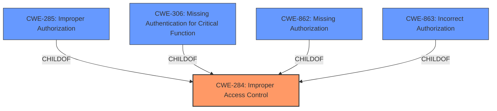

# Enhanced Analysis for CVE-2025-21197

# Summary
| CWE ID | CWE Name | Confidence | CWE Abstraction Level | CWE Vulnerability Mapping Label | CWE-Vulnerability Mapping Notes |
|---|---|---|---|---|---|
| CWE-284 | Improper Access Control | 0.8 | Pillar | Primary | Discouraged |

## Evidence and Confidence

*   **Confidence Score:** 0.8
*   **Evidence Strength:** MEDIUM

## Relationship Analysis
The primary relationship that influenced my decision was the parent-child relationship between CWE-284 and its children. Given the lack of specific details in the vulnerability description, I opted for the more general CWE-284. I also considered the guidance on authentication vs. authorization vs. access control. Since it is not clear whether the **improper access control** is due to **missing authentication**, **missing authorization**, or **incorrect authorization**, the more general CWE-284 is more appropriate.



## Vulnerability Chain
The vulnerability chain starts with **improper access control** leading to the disclosure of file path information.
  - Root Cause: **Improper access control** (CWE-284)
  - Impact: Disclosure of file path information

## Summary of Analysis
The initial analysis focused on identifying the root cause of the vulnerability, which is stated as **improper access control**. The retriever results suggested CWE-284, CWE-285, CWE-863 and CWE-306. However, based on the vulnerability description, it is unclear whether the issue is related to authentication, authorization, or a more general access control problem. The guidance provided emphasizes that CWE-284 should be used when the root cause is unclear. Because the description only specifies that the root cause is **improper access control** and does not mention Authentication or Authorization, I chose CWE-284.

Relevant CWE Information:

**Vulnerability Description**:
**Improper access control** in Windows NTFS allows an authorized attacker to disclose file path information under a folder where the attacker doesnt have permission to list content.
# Complete CWE Specifications

CWE-284: Improper Access Control
The product does not adequately control access to resources or actions.

CWE-285: Improper Authorization
The product does not perform or incorrectly performs an authorization check when an actor attempts to access a resource or perform an action.

CWE-863: Incorrect Authorization
The product performs an authorization check when an actor attempts to access a resource or perform an action, but it does not correctly perform the check.

CWE-306: Missing Authentication for Critical Function
The product does not perform any authentication for functionality that requires a provable user identity or consumes a significant amount of resources.


## CWE Relationship Analysis

Current CWEs represent these abstraction levels: .


### Vulnerability Chain Analysis

**Chain starting from CWE-863:**
- 863 (Incorrect Authorization) - ROOT


**Chain starting from CWE-862:**
- 862 (Missing Authorization) - ROOT


### CWE Relationship Diagram

```mermaid
graph TD
    classDef primary fill:#f96,stroke:#333,stroke-width:2px
    classDef secondary fill:#69f,stroke:#333
    classDef tertiary fill:#9e9,stroke:#333
```