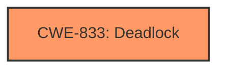

# Analysis Report for CVE-2025-21207

# Vulnerability Analysis Report: CVE-2025-21207

## Description

Windows Connected Devices Platform Service (Cdpsvc) Denial of Service Vulnerability

## Vulnerability Description Key Phrases

- **Product:** Windows Connected Devices Platform Service (Cdpsvc)
- **Impact:** Denial of Service, DoS

## Analysis (with Relationship Data)

# Summary
| CWE ID | CWE Name | Confidence | CWE Abstraction Level | CWE Vulnerability Mapping Label | CWE-Vulnerability Mapping Notes |
|---|---|---|---|---|---|
| CWE-833 | Deadlock | 0.5 | Base | Primary | Allowed |

## Evidence and Confidence

*   **Confidence Score:** 0.5
*   **Evidence Strength:** LOW

## Relationship Analysis
The primary candidate is CWE-833 (Deadlock). There are no specified parent-child or chain relationships to consider given the limited information.



## Vulnerability Chain
The vulnerability chain consists of the occurrence of a **Deadlock** leading to a Denial of Service.

## Summary of Analysis
The vulnerability description mentions a "Denial of Service Vulnerability" in the Windows Connected Devices Platform Service (Cdpsvc). The retriever results suggest CWE-833 (Deadlock) as the top candidate. Given the limited information in the description and the lack of CVE Reference Links Content Summary, the confidence in this mapping is low.

The decision is heavily based on the "Retriever Results" section, specifically the "Top Combined Results" table. The vulnerability description's key phrases only point to a "Denial of Service", which is a symptom rather than a root cause. Without further information, it is challenging to determine the exact nature of the **weakness**.

Several other CWEs were considered but ultimately rejected due to lack of evidence:
*   CWE-228: Improper Handling of Syntactically Invalid Structure
*   CWE-290: Authentication Bypass by Spoofing
*   CWE-306: Missing Authentication for Critical Function
*   CWE-1285: Improper Validation of Specified Index, Position, or Offset in Input
*   CWE-532: Insertion of Sensitive Information into Log File
*   CWE-20: Improper Input Validation
*   CWE-922: Insecure Storage of Sensitive Information
*   CWE-67: Improper Handling of Windows Device Names
*   CWE-129: Improper Validation of Array Index

Relevant CWE Information:


## CWE Relationship Analysis

Current CWEs represent these abstraction levels: .


### Vulnerability Chain Analysis

**Chain starting from CWE-290:**
- 290 (Authentication Bypass by Spoofing) - ROOT


**Chain starting from CWE-228:**
- 228 (Improper Handling of Syntactically Invalid Structure) - ROOT


### CWE Relationship Diagram

```mermaid
graph TD
    classDef primary fill:#f96,stroke:#333,stroke-width:2px
    classDef secondary fill:#69f,stroke:#333
    classDef tertiary fill:#9e9,stroke:#333
```


*Report generated on 2025-07-14 09:13:39*
