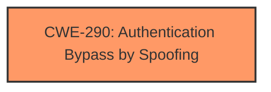

# Enhanced Analysis for CVE-2025-21217

# Summary
| CWE ID | CWE Name | Confidence | CWE Abstraction Level | CWE Vulnerability Mapping Label | CWE-Vulnerability Mapping Notes |
|---|---|---|---|---|---|
| CWE-290 | Authentication Bypass by Spoofing | 0.8 | Base | Allowed | Primary CWE. This vulnerability involves **spoofing**, aligning with the core characteristic of CWE-290. |

## Evidence and Confidence

*   **Confidence Score:** 0.8
*   **Evidence Strength:** LOW

## Relationship Analysis
The primary CWE identified is CWE-290 (Authentication Bypass by Spoofing). This CWE is a Base level weakness. There are no relationships to analyze given the limited information.



## Vulnerability Chain
The vulnerability chain consists of a single point:

1.  **Root Cause:** Authentication Bypass by Spoofing (CWE-290)

This is a direct mapping, as the vulnerability description explicitly mentions "Spoofing Vulnerability".

## Summary of Analysis
The initial analysis and resulting conclusion are based on the provided evidence, which is limited. The vulnerability description explicitly mentions "Spoofing Vulnerability", which strongly suggests CWE-290 (Authentication Bypass by Spoofing).

The selection of CWE-290 is at the optimal level of specificity because it directly reflects the described vulnerability.

Other CWEs Considered:

*   CWE-297, CWE-299, CWE-295, CWE-358, CWE-925, CWE-342, CWE-350, CWE-520, CWE-370: These CWEs were considered but not selected because the vulnerability description focuses on spoofing, making CWE-290 the most relevant. They relate to certificate validation, predictable values, and other issues that are not explicitly mentioned in the description.


## CWE Relationship Analysis

Current CWEs represent these abstraction levels: .


### Vulnerability Chain Analysis

**Chain starting from CWE-925:**
- 925 (Improper Verification of Intent by Broadcast Receiver) - ROOT


**Chain starting from CWE-290:**
- 290 (Authentication Bypass by Spoofing) - ROOT


### CWE Relationship Diagram

```mermaid
graph TD
    classDef primary fill:#f96,stroke:#333,stroke-width:2px
    classDef secondary fill:#69f,stroke:#333
    classDef tertiary fill:#9e9,stroke:#333
```