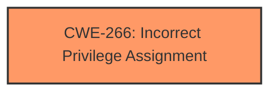

# Raw Analyzer Response for CVE-2025-21275

# Summary

| CWE ID | CWE Name | Confidence | CWE Abstraction Level | CWE Vulnerability Mapping Label | CWE-Vulnerability Mapping Notes |
|---|---|---|---|---|---|
| CWE-266 | Incorrect Privilege Assignment | 0.7 | Base | Allowed | Primary CWE. The **incorrect privilege assignment** is the root cause. |

## Evidence and Confidence

*   **Confidence Score:** 0.7
*   **Evidence Strength:** LOW

## Relationship Analysis
The primary focus is on CWE-266, which is a Base level CWE. The relationships of other CWEs were considered from the **Retriever Results**, but ultimately, based on the limited evidence, CWE-266 best fits the root cause.

## Vulnerability Chain
The chain of vulnerability starts with an **incorrect privilege assignment** (CWE-266), leading to an elevation of privilege.
- Root cause: CWE-266 (Incorrect Privilege Assignment)
- Impact: Elevation of Privilege

## Summary of Analysis
The analysis is based on the limited information provided in the vulnerability description. The key phrase "Elevation of Privilege" suggests that a privilege issue exists, and the guidance indicates that the underlying cause should be identified rather than just the impact. CWE-266 best describes the root cause of the vulnerability as it involves an **incorrect assignment of privileges**, leading to an unintended level of control.

The decision to choose CWE-266 is based on the guidance provided, which indicates that when there is an "Elevation of Privilege", then the root cause should be identified instead of just the impact.

Relevant CWE Information:

# Enhanced Context (25 CWEs)
The following CWEs were identified as potentially relevant to this vulnerability:

## CWE-266: Incorrect Privilege Assignment
**Abstraction Level**: Base
**Similarity Score**: 0.80
**Source**: dense

**Description**:
A product incorrectly assigns a privilege to a particular actor, creating an unintended sphere of control for that actor.

**Mapping Guidance**:
- Usage: Allowed
- Rationale: This CWE entry is at the Base level of abstraction, which is a preferred level of abstraction for mapping to the root causes of vulnerabilities.

## CWE-266: Incorrect Privilege Assignment
**Abstraction Level**: Base
**Similarity Score**: 1222.28
**Source**: sparse

**Description**:
A product incorrectly assigns a privilege to a particular actor, creating an unintended sphere of control for that actor.

**Mapping Guidance**:
- Usage: Allowed
- Rationale: This CWE entry is at the Base level of abstraction, which is a preferred level of abstraction for mapping to the root causes of vulnerabilities.