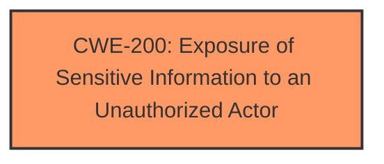

# Enhanced Analysis for CVE-2025-21301

# Summary
| CWE ID | CWE Name | Confidence | CWE Abstraction Level | CWE Vulnerability Mapping Label | CWE-Vulnerability Mapping Notes |
|---|---|---|---|---|---|
| CWE-200 | Exposure of Sensitive Information to an Unauthorized Actor | 0.7 | Class | Primary | Discouraged |

## Evidence and Confidence

*   **Confidence Score:** 0.7
*   **Evidence Strength:** LOW

## Relationship Analysis
The primary relationship considered was the parent-child relationship. CWE-200 is a class-level CWE, and while it broadly fits the vulnerability description, more specific child CWEs could potentially provide a better characterization if sufficient evidence were available. However, the provided information is too vague to determine a more precise root cause, making CWE-200 the most suitable option despite its discouraged usage.



## Vulnerability Chain
The vulnerability chain is very short. The **weakness** is an **Information Disclosure Vulnerability**, leading directly to the impact of Information Disclosure.

## Summary of Analysis
The initial analysis, based purely on the vulnerability description, points towards a broad category of information exposure. The vulnerability description key phrases confirm the presence of an **"Information Disclosure Vulnerability"**, and the impact is listed as "Information Disclosure". The lack of specific details about the root cause makes a precise CWE selection challenging.

The retriever results list CWE-200 as the top candidate, with a similarity score of 0.800. While CWE-200 is a class-level CWE and its usage is discouraged, the absence of more granular information prevents selection of a more specific base or variant CWE. The "CVE Reference Links Content Summary" section is unhelpful as it contains "UNRELATED".

Given the limited evidence, the selection of CWE-200 is based on the direct statement of **"Information Disclosure Vulnerability"** in the provided vulnerability description.

Relevant CWE Information:

**CWE-200: Exposure of Sensitive Information to an Unauthorized Actor**

**Technical Explanation:** The vulnerability involves the Windows Geolocation Service exposing sensitive information to an unauthorized actor. The specific mechanism of exposure is not detailed, but the core issue aligns with the definition of CWE-200.

**Security Implications and Potential Impact:** Exposure of sensitive information can lead to various security breaches, including identity theft, privacy violations, and unauthorized access to systems or data.

**Parent-Child Relationships and Chain Patterns:** CWE-200 is a class-level CWE. More specific child CWEs, like CWE-312 (Cleartext Storage of Sensitive Information) or CWE-319 (Cleartext Transmission of Sensitive Information), might be applicable if more details were known.

**Primary or Secondary Weakness:** CWE-200 is the primary weakness, representing the core vulnerability.

**MITRE Mapping Guidance:** The MITRE mapping guidance discourages the use of CWE-200 because it is a high-level class. However, in the absence of detailed information about the root cause, it is the most appropriate choice.

**Other CWEs Considered But Not Used:**
*   CWE-134 (Use of Externally-Controlled Format String): Not applicable because there is no mention of format string vulnerabilities.
*   CWE-126 (Buffer Over-read): Not applicable as there's no evidence of buffer over-read conditions.
*   CWE-201 (Insertion of Sensitive Information Into Sent Data): Possibly applicable, but lacks specific evidence.
*   CWE-862 (Missing Authorization): Not applicable because there is no mention of missing authorization.
*   CWE-311 (Missing Encryption of Sensitive Data): Not applicable as there's no evidence of missing encryption.
*   CWE-378 (Creation of Temporary File With Insecure Permissions): Not applicable as there's no evidence of insecure temporary files.
*   CWE-256 (Plaintext Storage of a Password): Not applicable as there's no evidence of plaintext password storage.
*   CWE-651 (Exposure of WSDL File Containing Sensitive Information): Not applicable because there is no mention of WSDL files.
*   CWE-1272 (Sensitive Information Uncleared Before Debug/Power State Transition): Not applicable as there's no evidence about debug/power state transition.


## CWE Relationship Analysis

Current CWEs represent these abstraction levels: .


### Vulnerability Chain Analysis

**Chain starting from CWE-378:**
- 378 (Creation of Temporary File With Insecure Permissions) - ROOT


**Chain starting from CWE-862:**
- 862 (Missing Authorization) - ROOT


### CWE Relationship Diagram

```mermaid
graph TD
    classDef primary fill:#f96,stroke:#333,stroke-width:2px
    classDef secondary fill:#69f,stroke:#333
    classDef tertiary fill:#9e9,stroke:#333
```