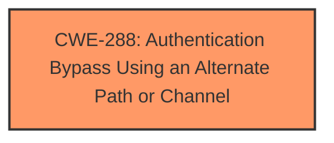

# Raw Analyzer Response for CVE-2025-21346

# Summary
| CWE ID | CWE Name | Confidence | CWE Abstraction Level | CWE Vulnerability Mapping Label | CWE-Vulnerability Mapping Notes |
|---|---|---|---|---|---|
| CWE-288 | Authentication Bypass Using an Alternate Path or Channel | 0.7 | Base | Primary | Allowed |

## Evidence and Confidence

*   **Confidence Score:** 0.7
*   **Evidence Strength:** LOW

## Relationship Analysis
The primary CWE selected is CWE-288, which is a Base level CWE. There are no direct parent-child or chain relationships that significantly influenced this decision due to the limited information provided.

## Vulnerability Chain
The description indicates a security feature bypass. The vulnerability chain is short, starting with a **missing** or **improper** authentication check and leading to the impact of a security feature bypass.
  - The **Primary CWE** should identify the issue that led to the vulnerability i.e. the first in the "Vulnerability Chain"

## Summary of Analysis
The analysis is primarily based on the vulnerability description indicating a "Security Feature Bypass." Given the limited information, the most suitable CWE appears to be CWE-288, "Authentication Bypass Using an Alternate Path or Channel," as it aligns with the concept of bypassing security features.

The selection of CWE-288 is based on the phrase "Security Feature Bypass", which may imply that an authentication mechanism is **missing** or **bypassed**, allowing unauthorized access or actions. CWE-288 directly addresses this scenario.

Relevant CWE Information:

# Enhanced Context (25 CWEs)
The following CWEs were identified as potentially relevant to this vulnerability:

## CWE-288: Authentication Bypass Using an Alternate Path or Channel
**Abstraction Level**: Base
**Similarity Score**: 0.70
**Source**: dense

**Description**:
The product requires authentication, but the product has an alternate path or channel that does not require authentication.

**Mapping Guidance**:
- Usage: Allowed
- Rationale: This CWE entry is at the Base level of abstraction, which is a preferred level of abstraction for mapping to the root causes of vulnerabilities.

Here's why other considered CWEs were not selected:

*   CWE-1104, CWE-357, CWE-23, CWE-88, CWE-732, CWE-798, CWE-1265, CWE-65, CWE-613: These CWEs do not directly address the "Security Feature Bypass" as explicitly as CWE-288.

# Summary
| CWE ID | CWE Name | Confidence | CWE Abstraction Level | CWE Vulnerability Mapping Label | CWE-Vulnerability Mapping Notes |
|---|---|---|---|---|---|
| CWE-288 | Authentication Bypass Using an Alternate Path or Channel | 0.7 | Base | Primary | Allowed |

## Evidence and Confidence

*   **Confidence Score:** 0.7
*   **Evidence Strength:** LOW

## Relationship Analysis
The primary CWE selected is CWE-288, which is a Base level CWE. There are no direct parent-child or chain relationships that significantly influenced this decision due to the limited information provided.

## Vulnerability Chain
The description indicates a security feature bypass. The vulnerability chain is short, starting with a **missing** or **improper** authentication check and leading to the impact of a security feature bypass.
  - The **Primary CWE** should identify the issue that led to the vulnerability i.e. the first in the "Vulnerability Chain"

## Summary of Analysis
The analysis is primarily based on the vulnerability description indicating a "Security Feature Bypass." Given the limited information, the most suitable CWE appears to be CWE-288, "Authentication Bypass Using an Alternate Path or Channel," as it aligns with the concept of bypassing security features.

The selection of CWE-288 is based on the phrase "Security Feature Bypass", which may imply that an authentication mechanism is **missing** or **bypassed**, allowing unauthorized access or actions. CWE-288 directly addresses this scenario.

Relevant CWE Information:

# Enhanced Context (25 CWEs)
The following CWEs were identified as potentially relevant to this vulnerability:

## CWE-288: Authentication Bypass Using an Alternate Path or Channel
**Abstraction Level**: Base
**Similarity Score**: 0.70
**Source**: dense

**Description**:
The product requires authentication, but the product has an alternate path or channel that does not require authentication.

**Mapping Guidance**:
- Usage: Allowed
- Rationale: This CWE entry is at the Base level of abstraction, which is a preferred level of abstraction for mapping to the root causes of vulnerabilities.

Here's why other considered CWEs were not selected:

*   CWE-1104, CWE-357, CWE-23, CWE-88, CWE-732, CWE-798, CWE-1265, CWE-65, CWE-613: These CWEs do not directly address the "Security Feature Bypass" as explicitly as CWE-288.