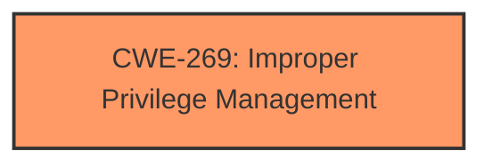

# Raw Analyzer Response for CVE-2025-21360

# Summary

| CWE ID | CWE Name | Confidence | CWE Abstraction Level | CWE Vulnerability Mapping Label | CWE-Vulnerability Mapping Notes |
|---|---|---|---|---|---|
| CWE-269 | Improper Privilege Management | 0.7 | Class | Primary CWE | Discouraged |

## Evidence and Confidence

*   **Confidence Score:** 0.7
*   **Evidence Strength:** LOW

## Relationship Analysis
The primary focus is on identifying a CWE that reflects the **impact** of "Elevation of Privilege" within the context of Microsoft AutoUpdate (MAU).

CWE-269 is a Class-level CWE that describes a general failure to properly manage privileges. While it's discouraged for being overly broad, in this case, the limited information available doesn't allow for a more specific Base or Variant CWE to be selected. It is the best candidate based on the available information.

## Vulnerability Chain
The chain of events, based solely on the description, is that a vulnerability exists in Microsoft AutoUpdate (MAU) which allows for Elevation of Privilege. The **root cause** is unknown. The **impact** is Elevation of Privilege.

## Summary of Analysis
The initial assessment considered various CWEs related to privilege management and access control, driven by the "Elevation of Privilege" **impact** statement. However, the lack of specific details regarding the **root cause** limits the selection to a more general CWE.

The primary driver for selecting CWE-269 is the stated **impact** of "Elevation of Privilege".

Given the limited evidence, CWE-269 is chosen as a high-level representation of the vulnerability. This choice acknowledges the lack of specificity and aims to capture the core security **impact**. The selection is based on the information provided, erring on the side of caution due to the potential for more specific CWEs to be applicable if more details were available.

Relevant CWE Information:

# Enhanced Context (25 CWEs)
The following CWEs were identified as potentially relevant to this vulnerability:

## CWE-269: Improper Privilege Management
**Abstraction Level**: Class
**Similarity Score**: 1197.59
**Source**: sparse

**Description**:
The product does not properly assign, modify, track, or check privileges for an actor, creating an unintended sphere of control for that actor.

**Mapping Guidance**:
- Usage: Discouraged
- Rationale: CWE-269 is commonly misused. It can be conflated with "privilege escalation," which is a technical impact that is listed in many low-information vulnerability reports [REF-1287]. It is not useful for trend analysis.