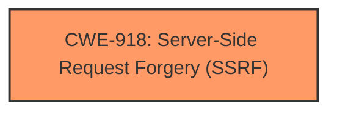

# Analysis Report for CVE-2025-21384

# Vulnerability Analysis Report: CVE-2025-21384

## Description

An authenticated attacker can exploit an **Server-Side Request Forgery (SSRF)** vulnerability in Microsoft Azure Health Bot to elevate privileges over a network.

## Vulnerability Description Key Phrases

- **Weakness:** Server-Side Request Forgery (SSRF)
- **Impact:** elevate privileges
- **Attacker:** authenticated attacker
- **Product:** Microsoft Azure Health Bot

## Analysis (with Relationship Data)

# Summary
| CWE ID | CWE Name | Confidence | CWE Abstraction Level | CWE Vulnerability Mapping Label | CWE-Vulnerability Mapping Notes |
|---|---|---|---|---|---|
| CWE-918 | Server-Side Request Forgery (SSRF) | 1.0 | Base | Allowed | Primary CWE |

## Evidence and Confidence

*   **Confidence Score:** 1.0
*   **Evidence Strength:** HIGH

## Relationship Analysis
The primary relationship considered was the direct match of the vulnerability description to CWE-918. While other CWEs were suggested, none matched the described **Server-Side Request Forgery (SSRF)** vulnerability as directly. The other CWEs were considered but deemed less relevant as they related to authorization, authentication, or specific types of injection, rather than the core issue of the server being coerced into making unintended requests.



## Vulnerability Chain
The vulnerability chain is straightforward:
1.  **Root Cause:** **Server-Side Request Forgery (SSRF)** (CWE-918) - The application allows an authenticated attacker to make the server send requests to unintended locations.
2.  **Impact:** Privilege Elevation - The attacker leverages SSRF to elevate privileges over a network.

## Summary of Analysis
The analysis is based directly on the vulnerability description, which explicitly states "**Server-Side Request Forgery (SSRF)**" as the **weakness**. The description also mentions that an authenticated attacker can "elevate privileges over a network." The primary focus is on the root cause: the SSRF vulnerability itself.

The retriever results strongly support CWE-918 as the top candidate, with a score of 0.800. The other CWEs suggested by the retriever, such as CWE-611, CWE-601, and CWE-287, were considered but ultimately rejected because they do not directly address the **SSRF** vulnerability.

The selection of CWE-918 is at the optimal level of specificity because it directly represents the **weakness** described in the vulnerability description.

Relevant CWE Information:

# Enhanced Context (25 CWEs)
The following CWEs were identified as potentially relevant to this vulnerability:

## CWE-918: Server-Side Request Forgery (SSRF)

## CWE-611: Improper Restriction of XML External Entity Reference

## CWE-601: URL Redirection to Untrusted Site ('Open Redirect')

## CWE-89: Improper Neutralization of Special Elements used in an SQL Command ('SQL Injection')

## CWE-941: Incorrectly Specified Destination in a Communication Channel

## CWE-352: Cross-Site Request Forgery (CSRF)

## CWE-93: Improper Neutralization of CRLF Sequences ('CRLF Injection')

## CWE-1004: Sensitive Cookie Without 'HttpOnly' Flag

## CWE-287: Improper Authentication

## CWE-613: Insufficient Session Expiration


## CWE Relationship Analysis

Current CWEs represent these abstraction levels: .


### Vulnerability Chain Analysis

**Chain starting from CWE-89:**
- 89 (Improper Neutralization of Special Elements used in an SQL Command ('SQL Injection')) - ROOT


**Chain starting from CWE-611:**
- 611 (Improper Restriction of XML External Entity Reference) - ROOT


### CWE Relationship Diagram

```mermaid
graph TD
    classDef primary fill:#f96,stroke:#333,stroke-width:2px
    classDef secondary fill:#69f,stroke:#333
    classDef tertiary fill:#9e9,stroke:#333
```


*Report generated on 2025-07-14 09:29:45*
